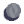
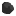

# Characteristics

**NOTICE: A lot of the content on this page is not up-to-date and refers to an older version of the game.**

## Cost [Items]

Cost is how much time an item adds to the time it takes to build a block that uses it. One `cost` = one tick added to build time.

For example, the Battery requires 8CP, 30LE, and 4SI. The build time is processed like this:

`(0.6 * 8) + (0.9 * 30) + (0.9 * 8) = 39`

Therefore, it takes 39 ticks to build a Battery by yourself.

## Hardness [Items]

The time it takes to mine one item is partially dependent on the hardness of an item. Sand is the least hardest, while Thorium is the hardest. 

[needs correction] For example, mining Copper with your Mining Laser gets you copper much faster than when mining Thorium. That is because Thorium is harder than Copper. 

## Radioactivity [Items]

Radioactivity is the potency of the material in nuclear-based blocks like the RTG. In said block, Thorium generates more electricity than Phase because it is much more radioactive.

## Flammability [Items, Liquids]

As it suggests, it is the measure of flammability of an item or liquid. It is also the speed at which it burns and the speed at which it spreads across blocks that are made of it, and enemies which are hit by it as a projectile. 

For example, Plastanium burns slower than Coal, which burns much slower than Pyratite. Furthermore, when Pyratite is used as ammo, it will burn enemies faster and stronger than Blast Compound. When Lava is used as an ammo in the Wave, it will burn enemies unlike Cryofluid or Oil.

**Tip:** Make sure distribution blocks (Conveyors, Vaults, Bridges) that contain flammable or explosive materials are protected and kept away from potential damage, like a Reactor or enemy path. For example, if a Reactor explodes near a conveyor with Coal, the majority of the conveyor will immediately explode because of the Coal on it.

## Explosiveness [Items, Liquids]

As it suggests, it is the measure of explosiveness of an item or liquid. That is most useful in an ammunition application, where the most explosive item (not liquid) will deal the largest damage over the largest area. Blast Compound is the most explosive item as its name, "Blast", suggests.

Oil is the most and only explosive liquid. If shot from a Wave and set on fire using Pyratite or Lava, it will burn and explode enemies that are around it. The same thing goes for Liquid Tanks and the such that are filled with it.

**Tip:** Keep explosive material protected and separate from your Core or any exposed lines, unless it is needed. It is highly explosive and when triggered, will deal damage to surrounding blocks as well. Read the previous tip, too.

## Heat Capacity [Liquids]

Heat capacity is the measure of the effectiveness of a liquid in absorbing and dissipating heat. The higher the Heat Cap., the faster it will cool things like the Thorium Reactor down. 

## Temperature [Liquids]

The temperature of a liquid.

## Viscosity [Liquids]

Viscosity determines the speed at which a liquid flows. A higher viscosity means it flows slower, while a lower one means it flows much faster.

## Status Effect [Liquids]

The status effect of the liquid is passed on to an entity that is hit by it or is standing on it. 

### Melting

Lava has the "melting" status effect, which means that enemies that are hit by it (from a Wave) or are standing on a puddle of it will start burning and melting. 

### Tarred

With the "tarred" status effect, enemies will move slower and be more susceptible to fire.

### Freezing

Enemies will move extremely slow as they freeze. This is useful for slowing down swift air enemies to make them easier to shoot. 
