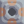
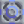
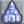

# </img> Copper 

*"A useful structure material. Used extensively in all types of blocks."*  

| Property      | Value |
| ----------- | ----------- |
|Internal Name|`copper`|
|Color|`d99d73`|
|Type|Material|
|Flammability|0%|
|Explosiveness|0%|
|Radioactivity|0%|
|Naturally Occurring|Yes|
|Build Cost|50%|
|Hardness|1|

--- 

##### Produced in:      

##### Required for:   

##### Used to build:                                                       
[comment]: # (WARNING: Do not modify the text above. It is automatically generated every release.)

