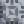
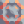

# Graphite 
  

*"null"*  

| Property      | Value |
| ----------- | ----------- |
|Internal Name|`graphite`|
|Color|`b2c6d2`|
|Type|Material|
|Flammability|0%|
|Explosiveness|0%|
|Radioactivity|0%|
|Naturally Occurring|No
|Build Cost|100%|
|Hardness|0|

--- 

##### Produced in:    

##### Used to build:                           
[comment]: # (WARNING: Do not modify the text above. It is automatically generated every release.)

