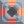
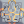

# Thorium 
  

*"A dense, radioactive metal used as structural support and nuclear fuel."*  

| Property      | Value |
| ----------- | ----------- |
|Internal Name|`thorium`|
|Color|`f9a3c7`|
|Type|Material|
|Flammability|0%|
|Explosiveness|20%|
|Radioactivity|100%|
|Naturally Occurring|Yes
|Build Cost|110%|
|Hardness|4|

--- 

##### Produced in:    

##### Required for:       

##### Used to build:                     
[comment]: # (WARNING: Do not modify the text above. It is automatically generated every release.)

