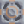
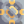
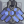
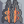

# Water 
  

| Property      | Value |
| ----------- | ----------- |
|Internal Name|`water`|
|Flammability|0%|
|Explosiveness|0%|
|Heat Capacity|40%|

*"Commonly used for cooling machines and waste processing."*

--- 

##### Produced in:       

##### Required for:                         
[comment]: # (WARNING: Do not modify the text above. It is automatically generated every release.)

