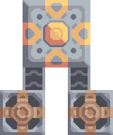
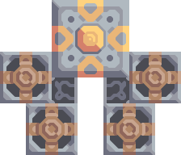
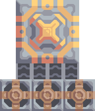
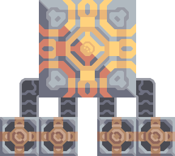
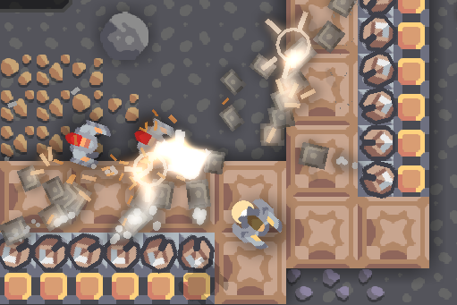

# Modding

Mindustry mods are simply directories of assests. There are many ways to use the modding API, depending on exactly what you want to do, and how far you're willing to go to do it.

You could just resprite existing game content, you can create new game content with the simpler Json API (which is the main focus of this documentation), you can add custom sounds (or reuse existing ones). It's possible to add maps to compaing mode, and add scripts to program special behavior into your mod, like custom effects. 

Sharing your mod is as simple as giving someone your project directory; mods are also cross platfrom to any platform that supports them. Realistically speaking you'll want to use [GitHub](#github), you should also checkout the Example Mod repository on GitHub: <https://github.com/Anuken/ExampleMod>

To make mods all you really need is any computer with a text editor.

## Directory Structure

Your project directory should look something like this:

    project
    ├── mod.json
    ├── content
    │   ├── items
    │   ├── blocks
    │   ├── mechs
    │   ├── liquids
    │   ├── units
    │   └── zones
    ├── maps
    ├── bundles
    ├── sounds
    ├── schematics
    ├── scripts
    ├── sprites-override
    └── sprites

-   [`mod.json`](#modjson) (required) metadata file for your mod,
-   `content/*` directories for game [Content](#content),
-   `maps/` directory for [Zone](#zone) maps,
-   `bundles/` directory for [Bundles](#bundles),
-   `sounds/` directory for [Sound](#sound) files,
-   `schematics/` directory for [Schematic](#schematic) files,
-   `scripts/` directory for [Scripts](#scripts),
-   `sprites-override/` [Sprites](#sprites) directory for overriding ingame content,
-   `sprites/` [Sprites](#sprites) directory for your content,

Every platform has a different user application data directory, and this is where your mods should be placed:

-   Linux: `~/.local/share/Mindustry/mods/`
-   Steam: `steam/steamapps/common/Mindustry/mods/`
-   Windows: `%appdata%/Mindustry/mods/`
-   Apple: `~/Library/Application Support/Mindustry/mods/`

*Note that your filenames should be lowercased and hyphen separated:*

-   correct: `my-custom-block.json`
-   incorrect: `My Custom Block.json`

## Hjson

Mindustry uses [Hjson](https://hjson.org/), which for anyone who knows Json, is simply a superset of the very popular serialization language known as [Json](https://en.wikipedia.org/wiki/JSON). &#x2013; This means that any valid Json will work, but you get extra useful stuff:

    # single line comment
    
    // single line comment
    
    /* multiline
    comment */
    
    key1: single line string
    
    key2:
    '''
    multiline
    string
    '''
    
    key3: [ value 1
            value 2
            value 3 ]
    
    key4: { key1: string
            key2: 0 }

If you don't know any of those words. &#x2013; A serialization language, is simply a language which encodes information for a program, and *encode* means to translate informantion from one form to another, and in this case, to translate text into Java data structures.

## `mod.json`

At the root of your project directory, you must have a `mod.json` which defines the basic metadata for your project. This file can also be (optionally) named `mod.hjson` to potentially help your text editor pick better syntax highlighting.

    name: Mod Name
    displayName: Mod [red]Name[]
    author: Yourself
    description: This is a useless description.
    version: "1.0"
    minGameVersion: "100.3"
    dependencies: [ ]

-   `name` will be used to reference to your mod, so name it carefully;
-   `displayName` this will be used as a display name for the UI, which you can use to add formatting to said name;
-   `description` of the mod will be rendered in the ingame mod manager, so keep it short and to the point;
-   `dependencies` is optional, if you want to know more about that, go to the [dependencies](#dependencies) section;
-   `minGameVersion` is the minimum build version of the game.

## Content

At the root of your project directory you can have a `content/` directory, and this is where all the Json/Hjson data goes. Inside of `content/` you have subdirectories for the various kinds of content, these are the current common ones:

-   `content/items/` for [items](#item), like `copper` and `surge-alloy`;
-   `content/blocks/` for [blocks](#block), like turrets and floors;
-   `content/mechs/` for [mechs](#mech), like `tau` and `glaive`;
-   `content/liquids/` for [liquids](#liquid), like `water` and `slag`;
-   `content/units/` for flying or ground [units](#unittype), like `reaper` and `dagger`;
-   `content/zones/` for [zones](#zone), configuration of campaign maps.

Note that each one of these subdirectories needs a specific content type. The filenames of these files is important, because the stem name of your path *(filename without the extension)* is used to reference it.

Furthermore the files within theseb `content/<content-type>/*` directories may be arbitrarly nested into other sub-directories of any name, to help you organize them further, for example:

-   `content/items/metals/iron.hjson`, which would respectively create an item named `iron`.

The content of these files will tend to look something like this:

    type: TypeOfThing
    name: Name Of Thing
    description: Description of thing.
    # ... more fields here ...

|field|type|notes|
|---|---|---|
|type|String|Content type of this object.|
|name|String|Displayed name of content.|
|description|String|Displayed description of content.|

Other fields included will be the fields of the type itself.

## Types

Types have numerous fields, but the important one is `type`; this is a special field used by the content parser, that changes which type your object is. *A `Router` type can't be a `Turret` type*, as they're just completely different.

Types *extend* each other, so if `MissileBulletType` extends `BasicBulletType`, you'll have access to all the fields of `BasicBulletType` inside of `MissileBulletType` like `damage`, `lifetime` and `speed`. Fields are case sensitive: `hitSize =/= hitsize`.

What you can expect a field to do is up to the specific type, some types do absolutely nothing with their fields, and work mostly as a base types will extend from. One such type is `Block`.

`type` can be refer to the actual type field of the object. A type may also refer to other things like `float` is a type so it means you can type `0.3` in a field.

Here you can see, the type of the top level object is `Revenant`, but the type of the `bullet` is `BulletType` so you can use `MissileBulletType`, because `MissileBulletType` extends `BulletType`.

    type: Revenant
    weapon: {
      bullet: {
        type: MissileBulletType
        damage: 9000
      }
    }

## Tech Tree

Much like `type` there exist another magical field known as `research` which can go at the root of any block object to put it in the techtree.

    research: duo

This would put your block after `duo` in the techtree, and to put it after your own mods block you would write your `<block-name>`, a mod name prefix is only required if you're using the content from another mod.

Research cost will be `40 + round(requirements ^ 1.25) * 6 rounded down to the nearest 10`, where `requirements` is the build cost of your block. *(in otherwords you can't set `requirements` and `research cost` individually)*

## Sprites

All you need to make sprites, is an image editor that supports transparency *(aka: not paint).* Block sprites should be `32 * size`, so a `2x2` block would require a `64x64` image. Images must be `.png` files with 32 bit depth.

Sprites can simply be dropped in the `sprites/` subdirectory. The content parser will look through it recursively, so you can organize them how ever you feel.

Content is going to look for sprites relative to it's own name. `content/blocks/my-hail.json` has the name `my-hail` and similarly `sprites/my-hail.png` has the name `my-hail`, so it'll be used by this content.

Content may look for multiple sprites. `my-hail` could be a turret, and it could look for the suffix `<name>-heat` and what this means is it'll look for `my-hail-heat`.

You can find all the vanilla sprites here:

-   <https://github.com/Anuken/Mindustry/tree/master/core/assets-raw/sprites>

Another thing to know about sprites is that some of them are modified by the game. Turrets specifically have a black border added to them, so you must account for that while making your sprites, leaving transparent space around turrets for example: [Ripple](https://raw.githubusercontent.com/Anuken/Mindustry/master/core/assets-raw/sprites/blocks/turrets/ripple.png)

To override ingame content sprites, you can simply put them in `sprites-override/`.

## Sound

Custom sounds can be added through the modding system by dropping them in the `sounds/` subdirectory. It doesn't matter where you put them. Two formats are needed:

-   `.ogg` required for Desktop/Android
-   `.mp3` required for iOS

Just like any other assets, you reference them by the stem of your filenames, so `pewpew.ogg` and `pewpew.mp3` can be referenced with `pewpew` from a field of type `Sound`.

Here's a list of built-in sounds:

-   `artillery`
-   `back`
-   `bang`
-   `beam`
-   `bigshot`
-   `boom`
-   `break`
-   `build`
-   `buttonClick`
-   `click`
-   `conveyor`
-   `corexplode`
-   `door`
-   `drill`
-   `empty`
-   `explosionbig`
-   `explosion`
-   `fire`
-   `flame2`
-   `flame`
-   `laserbig`
-   `laser`
-   `machine`
-   `message`
-   `missile`
-   `pew`
-   `place`
-   `press`
-   `release`
-   `respawning`
-   `respawn`
-   `shootBig`
-   `shoot`
-   `shootSnap`
-   `shotgun`
-   `spark`
-   `splash`
-   `spray`
-   `thruster`
-   `unlock`
-   `wave`
-   `windowHide`

## Dependencies

You can add dependencies to your mod by simple adding other mods name in your `mod.json`:

    dependencies: [
      other-mod-name
      not-a-mod
    ]

The name of dependencies are lower-cased and spaces are replaced with `-` hyphens, for example `Other MOD NamE` becomes `other-mod-name`.

To reference the other mods assets, you must prefix the asset with the other mods name:

-   `other-mod-name-not-copper` would reference `not-copper` in `other-mod-name`
-   `other-mod-name-angry-dagger` would reference `angry-dagger` in `other-mod-name`
-   `not-a-mod-angry-dagger` would reference `angry-dagger` in `not-a-mod`

## Bundles

An optional addition to your mod is called bundles. The main use of bundles are give translations of your content, but there's no reason you couldn't use them in English. These are plaintext files which go in the `bundles/` subdirectory, and they should be named something like `bundle_ru.properties` (for Russian).

The contents of this file is very simple:

    block.example-mod-silver-wall.name = Серебряная Стена
    block.example-mod-silver-wall.description = Стена из серебра.

If you've read the first few sections of this guide, you'll spot it right away:

-   `<content type>.<mod name>-<content name>.name`
-   `<content type>.<mod name>-<content name>.description`

Notes:

-   mod/content names are lowercased and hyphen separated.

List of content type:

-   `item`
-   `block`
-   `mech`
-   `bullet`
-   `liquid`
-   `status`
-   `unit`
-   `weather`
-   `effect`
-   `zone`
-   `loadout`
-   `typeid`

List of filenames relative to languages:

-   English `bundle.properties`
-   Czech `bundle_cs.properties`
-   German `bundle_de.properties`
-   Spanish `bundle_es.properties`
-   Estonian `bundle_et.properties`
-   Basque `bundle_eu.properties`
-   French BE `bundle_fr_BE.properties`
-   French `bundle_fr.properties`
-   Bergabung `bundle_in_ID.properties`
-   Italian `bundle_it.properties`
-   Japanese `bundle_ja.properties`
-   Korean `bundle_ko.properties`
-   Dutch BE `bundle_nl_BE.properties`
-   Dutch `bundle_nl.properties`
-   Polish `bundle_pl.properties`
-   Portuguese BR `bundle_pt_BR.properties`
-   Portuguese  `bundle_pt.properties`
-   Russian `bundle_ru.properties`
-   Danish `bundle_sv.properties`
-   Turkman `bundle_tk.properties`
-   Turkish `bundle_tr.properties`
-   Ukrainian `bundle_uk_UA.properties`
-   Chinese CN `bundle_zh_CN.properties`
-   Chinese TW `bundle_zh_TW.properties`

## Markup

The text renderer uses a simple makeup language for coloring text.

-   `[name]` sets the color by name, there's a few [built-in colors](#built-in-colors);
-   `[#rrggbb]` / `[#rrggbbaa]` sets the color by hex value, with each value being anything from `00` to `ff`:
    -   `rr` is the red value,
    -   `gg` is the green value,
    -   `bb` is the blue value,
    -   `aa` is the alpha value;
-   `[]` sets the color back to the previous color;
-   `[[` escapes the left bracket, so you can write `[[red]` to write and it'll render as `[red]`.

Notes:

-   erros/unknown colors will be silently ignored.

Example:

    [red]red
    [#ff0000]full-red
    [#ff000066]half-red
    [#ff000033]half-half-red
    [#00ff00]green
    []half-half-red

### Built-in Colors

    [clear]clear
    [black]black
    [white]white
    [lightgray]lightgray
    [gray]gray
    [darkgray]darkgray
    [blue]blue
    [navy]navy
    [royal]royal
    [slate]slate
    [sky]sky
    [cyan]cyan
    [teal]teal
    [green]green
    [acid]acid
    [lime]lime
    [forest]forest
    [olive]olive
    [yellow]yellow
    [gold]gold
    [goldenrod]goldenrod
    [orange]orange
    [brown]brown
    [tan]tan
    [brick]brick
    [red]red
    [scarlet]scarlet
    [coral]coral
    [salmon]salmon
    [pink]pink
    [magenta]magenta
    [purple]purple
    [violet]violet
    [maroon]maroon

## Schematic

Fields that require the type `Schematic` can either take a built-in loadout *(see the [Zone](#zone) section)* a base64 string, or the stem name of a `.msch` file in the `schematics/` subdirectory.

*As of now, the only purpose of schematics is to give a zone a loadout.*

## Scripts

Scripting in Mindustry is done with the [Rhino JavaScript](https://github.com/mozilla/rhino) runtime. Scripts may be added to your mod by putting them in `scripts/`. Using the built-in `extendContent` function, you can extend existing Java types from JS, using *allowed classes* which are injected into your namespace.

For example:

-   `scripts/silo.js`
    
        // create a simple shockwave effect
        const siloLaunchEffect = newEffect(20, e => {
        
            // color goes from white to light gray
            Draw.color(Color.white, Color.lightGray, e.fin());
        
            // line thickness goes from 3 to 0
            Lines.stroke(e.fout() * 3);
        
            // draw a circle whose radius goes from 0 to 100
            Lines.circle(e.x, e.y, e.fin() * 100);
        });
        
        // create the block type
        const silo = extendContent(Block, "scatter-silo", {
        
            // override the method to build configuration
            buildConfiguration(tile, table) {
                table.addImageButton(
                    Icon.arrowUpSmall,
                    Styles.clearTransi,
        
                    // configure the tile to signal that it has been
                    // pressed (this sync on client to server)
                    run(() => tile.configure(0))
                ).size(50);
            },
        
            // override configure event
            configured(tile, value) {
        
                // make sure this silo has the items it needs to fire
                if (tile.entity.cons.valid()) {
        
                    // make this effect occur at the tile location
                    Effects.effect(siloLaunchEffect, tile);
        
                    // create 10 bullets at this tile's location with
                    // random rotation and velocity/lifetime
                    for (var i = 0; i < 10; i++) {
                        Calls.createBullet(
                            Bullets.flakExplosive,
                            tile.getTeam(),
                            tile.drawx(),
                            tile.drawy(),
                            Mathf.random(360),
                            Mathf.random(0.5, 1.0),
                            Mathf.random(0.2, 1.0)
                        );
                    }
        
                    // triggering consumption makes it use up the
                    // items it requires
                    tile.entity.cons.trigger();
                }
            }
        });

-   `content/blocks/scatter-silo.hjson`
    
        localizedName: "Scatter Silo"
        description: "A player-activatable block that scatters bullets everywhere upon use."
        
        category: turret
        size: 2
        
        update: true
        solid: true
        hasItems: true
        configurable: true
        
        requirements: [ "graphite/75"
                        "titanium/30" ]
        
        consumes: { items: { items: [ "scrap/10" ] } }

More examples:

-   [entity-lib](https://github.com/DeltaNedas/entity-lib)

## GitHub

Once you have a mod of some kind, you'll want to actually share it, and you may even want to work with other people on it, and to do that you can use [GitHub](https://github.com/). If you don't know what Git (or GitHub) is at all, then you should look into [GitHub Desktop](https://desktop.github.com/), otherwise simply use your favorite command line tool or text editor plugin. 

All you need understand is how to open repositories on GitHub, stage and commit changes in your local repository, and push changes to the GitHub repository. Once your project is on GitHub, there are three ways to share it:

-   with the endpoint, for example `Anuken/ExampleMod`, which could then be typed in the ingame GitHub interface, and that would download it;
-   with the zip file, for example `https://github.com/Anuken/ExampleMod/archive/master.zip`, which would download the repository as a zip file, and put in mod directory (unzipping is not required);
-   add the typic/tags `mindustry-mod` on your repository, which should cause the `#mods` Discord bot to pick it up and render it in it's listh.

## FAQ

-   `time` in game is calculated through `ticks`;
-   `ticks` *sometimes called `frames`,* are assumed to be 60/1 second;
-   `tilesize` is 8 units internally;
-   to calculate range out of `lifetime` and `speed` you can do `lifetime * speed = range`;
-   *Abstract* what is `abstract`? all you need to know about abstract types, is this is a Java specific term, which means you cannot instantiate/initialize this specific type by itself. If you do so you'll probably get an *"initialization exception"* of some kind;
-   what is a `NullPointerException`? This is an error message that indicates a field is null and shouldn't be null, meaning one of the required fields may be missing;
-   *bleeding-edge* what is `bleeding-edge`? This is the developer version of Mindustry, specifically it's refering to the Github master branch. Changes on bleeding-edge usually make it into Mindustry in the next release.

## Change Log

This is a log of changes done on the Mindustry Master branch that affected the modding API. The sections are ordered by date commited, and provide a description of what was changed, with a link to the diff on Github.

### 2020

#### Mar 5

[ [commit](https://github.com/Anuken/Mindustry/commit/50355b45d5eb5c09c19f8d7c6bba48c568a609a8) Tech tree balance ]

-   updated research cost formula

#### Feb 11

[ [commit](https://github.com/Anuken/Mindustry/commit/fb302d49c7de104675c7c33c0e98e4f31e735bd7) improved battery brightness display ]

-   added `<name>-top` region for battery;

#### Jan 24

[ [commit](https://github.com/Anuken/Mindustry/commit/923d576a5fb7553eb28fa7ebc8a9c16fd4fe6ceb) fixed #1436 / fixed crawlers not exploding ]

-   added `instantDisappear` to `BulletType`;

#### Jan 23

[ [commit](https://github.com/Anuken/Mindustry/commit/235142c8698f0d8cd9fc296a2ecabf430d7ea261) implemented #1093 ]

-   added `attribute` to `ThermalGenerator`;

#### Jan 22

[ [commit](https://github.com/Anuken/Mindustry/commit/a4e820f90733148de4b75f5b60928e0523bf51b3) added default ore flags for modded ores ]

-   added `oreDefault`, `oreThreshold` and `oreScale` to `Floor`;

#### Jan 19

[ [commit](https://github.com/Anuken/Mindustry/commit/b1df52e0c83ae44f5bd70892fcda5ac2fa69e36c) cleanup of scripts ]

-   added `killShooter` attribute for `BulletType`;

#### Jan 14

[ [commit](https://github.com/Anuken/Mindustry/commit/eaa86023f9854b6e8d574cbfdd43ee32488b2de5) visual tweaks ]

-   added `-spinner` region to `Separator`;
-   removed `spinnerRadius`, `spinnerLength`, `spinnerThickness`, `color` from `Separator`;

#### Jan 08

[ [commit](https://github.com/Anuken/Mindustry/commit/406c11a14d31c9680b914c60cd1d8577ddd5fc7d) make rebuildable a block attribute (#1338) ]

-   added `rebuildable` to `Block`;

#### Jan 07

[ [commit](https://github.com/Anuken/Mindustry/commit/b0d65dcedb26014580632a9b0d8d597f0c7f8ccc) cleanup ]

-   added `drawCell`, `drawItems` and `drawLight` to `Mech`;

#### Jan 04

[ [commit](https://github.com/Anuken/Mindustry/commit/1dd0295c45e6ea6f0967f291b41ff3a58ab7202c) merge remote-tracking branch 'origin/master' ]

-   added `targetDistance` to `Weapon`;

#### Jan 03

[ [commit](https://github.com/Anuken/Mindustry/pull/1313/commits/62b2b25ee474fcf44aa86832c1373b38e16d703d) use findAll to iterate through mod content ]

-   `content/` support for organizing `.hjson` files into directories;

### 2019

#### Dec 12

[ [commit](https://github.com/Anuken/Mindustry/commit/2366d25de73ab85bffc3352ab1e74ba1dea68dfe) add liquid void block ]

-   added `LiquidVoid` block;

#### Dec 09

[ [commit](https://github.com/Anuken/Mindustry/commit/74dc31b10a82763d4f1ff29d32ae430ee87b9def)  Removed unnecessary unit types ]

-   changed unit types names:
    -   `Draug` &rarr; `MinerDrone`;
    -   `Spirit` &rarr; `RepairDrone`;
    -   `Phantom` &rarr; `BuilderDrone`;
    -   [ `Dagger` `Crawler` `Titan` `Fortress` `Eruptor` ] &rarr; `GroundUnit`;
    -   [ `Wraith` `Ghoul` ] &rarr; `FlyingUnit`;
    -   `Revenant` &rarr; `HoverUnit`;

#### Dec 08

[ [commit](https://github.com/Anuken/Mindustry/commit/268f3cc3c) Merge branches `master` and `rhino-js-suffering` ]

-   `scripts/` sub-directory and Rhino JS runtime was added;
-   `displayName` can now be used as field name in `mod.json`

#### Dec 04

[ [commit](https://github.com/Anuken/Mindustry/commit/a087df077) Added experimental server block syncing ]

-   `sync` field for `Block` type was added;

#### Nov 26

[ [commit](https://github.com/Anuken/Mindustry/commit/a5fbc0756) Texture overrides / Potential mod texture binding optimizations ]

-   `sprites-override/` subdirectory can now be used to override existing ingame sprites;

#### Nov 22

[ [commit](https://github.com/Anuken/Mindustry/commit/2d4270406) Switched to hjson extension ]

-   `.hjson` can now be used as a file extension;

#### Nov 22

[ [commit](https://github.com/Anuken/Mindustry/commit/2c61fcdfa) Added optional mod minimum game version ]

-   `minGameVersion` can now be used within `mod.json`;

#### Nov 20

[ [commit](https://github.com/Anuken/Mindustry/commit/968f3ace3) Better mod parsing ]

-   `liquid/amount` can now be used as a string for `LiquidStack`;
-   `item/amount` can now be used as a string for `ItemStack`;
-   `mod.json` now supports hjson;

# World

## Block

Extends [BlockStorage](#blockstorage)

Block is the base type of all blocks in the game. All blocks have at least one sprite, which is picked relative to the blocks name.

Fields for all objects that are blocks.

|field|type|default|notes|
|---|---|---|---|
|update|boolean|&#xa0;|whether this block has a tile entity that updates|
|destructible|boolean|&#xa0;|whether this block has health and can be destroyed|
|unloadable|boolean|true|whether unloaders work on this block|
|solid|boolean|&#xa0;|whether this is solid|
|solidifes|boolean|&#xa0;|whether this block CAN be solid.|
|rotate|boolean|&#xa0;|whether this is rotateable|
|breakable|boolean|&#xa0;|whether you can break this with rightclick|
|rebuildable|boolean|true|whether to add this block to brokenblocks or not (like `ShockMine` or `NuclearReactor`)|
|placeableOn|boolean|true|whether this [floor](#floor) can be placed on.|
|insulated|boolean|false|whether this block has insulating properties.|
|health|int|-1|tile entity health|
|baseExplosiveness|float|0|base block explosiveness|
|floating|boolean|false|whether this block can be placed on edges of liquids.|
|size|int|1|multiblock size; 1 makes the block 1x1, 2 makes the block 2x2, and so on.|
|expanded|boolean|false|Whether to draw this block in the expanded draw range.|
|timers|int|0|Max of timers used.|
|cacheLayer|[CacheLayer](#cachelayer)|normal|Cache layer. Only used for 'cached' rendering.|
|fillesTile|true|&#xa0;|Special flag; if false, [floor](#floor) will be drawn under this block even if it is cached.|
|alwaysReplace|boolean|false|whether this block can be replaced in all cases|
|group|[BlockGroup](#blockgroup)|none|Unless `canReplace` is overriden, blocks in the same group can replace each other.|
|priority|[TargetPriority](#targetpriority)|base|Targeting priority of this block, as seen by enemies.|
|configurable|boolean|&#xa0;|Whether the block can be tapped and selected to configure.|
|consumesTap|boolean|&#xa0;|Whether this block consumes touchDown events when tapped.|
|drawLiquidLight|boolean|true|Whether to draw the glow of the liquid for this block, if it has one.|
|posConfig|boolean|&#xa0;|Whether the config is positional and needs to be shifted.|
|sync|boolean|&#xa0;|Whether to periodically sync this block across the network.|
|targetable|boolean|true|Whether units target this block.|
|canOverdrive|boolean|true|Whether the overdrive core has any effect on this block.|
|outlineColor|[Color](#color)|404049|Outlined icon color.|
|outlineIcon|boolean|false|Whether the icon region has an outline added.|
|hasShadow|boolean|true|Whether this block has a shadow under it.|
|breakSound|[Sound](#sound)|boom|Sounds made when this block breaks.|
|activeSound|[Sound](#sound)|none|The sound that this block makes while active. One sound loop. Do not overuse.|
|activeSoundVolume|float|0.5|Active sound base volume.|
|idleSound|[Sound](#sound)|none|The sound that this block makes while idle. Uses one sound loop for all blocks.|
|idleSoundVolume|float|0.5|Idle sound base volume.|
|requirements|[ [ItemStack](#itemstack) ]|&#xa0;|Cost of constructing and researching this block.|
|category|[Category](#category)|distribution|Category in place menu.|
|buildCost|float|&#xa0;|Cost of building this block; do not modify directly!|
|buildVisibility|[BuildVisibility](#buildvisibility)|hidden|Whether this block is visible and can currently be built.|
|buildCostMultiplier|float|1|Multiplier for speed of building this block.|
|instantTransfer|boolean|false|Whether this block has instant transfer.|
|alwaysUnlocked|boolean|false|&#xa0;|
|layer|[Layer](#layer)|null|Layer to draw extra stuff on.|
|layer2|[Layer](#layer)|null|Extra layer to draw extra stuff on.|

Sprites:

-   `<name>` the main sprite for the block.

## Consumers

This type is commonly used in block type with it's field `consumes`, it's a type that allows your block to consume something, and how this field works is up to the specific type extension you're using.

|field|type|notes|
|---|---|---|
|item|String|shorthand for `items`|
|items|[ConsumeItems](#consumeitems)|consume a number of different items|
|liquid|[ConsumeLiquid](#consumeliquid)|consume a single liquid|
|power|float or [ConsumePower](#consumepower)|consume or buffer power|
|powerBuffered|float|amount of power buffered|

Notes:

-   you shouldn't have `power` and `powerBuffered`.

For example with [ConsumeItems](#consumeitems) and [ConsumeLiquid](#consumeliquid):

    items: {
      items: [
        copper/10
        surge-alloy/5
      ]
      booster: true
      optional: true
    }
    liquid: {
      water/1.0
    }

## Consume

[Abstract](#faq) type which defines a type of resource that a block can consume.

|field|type|default|notes|
|---|---|---|---|
|optional|boolean|&#xa0;|consumer will not influence consumer validity.|
|booster|boolean|&#xa0;|consumer will be displayed as a boost input.|
|update|boolean|true|&#xa0;|

### ConsumeItems

Extends [Consume](#consume)

Type to consume ItemStacks.

|field|type|
|---|---|
|items|[ [ItemStack](#itemstack) ]|

### ConsumeLiquid

Extends [Consume](#consume)

Type to consume a LiquidStack.

|field|type|default|notes|
|---|---|---|---|
|liquid|String|&#xa0;|the name of [liquid](#liquid) type consumed|
|amount|float|&#xa0;|amount used per frame|
|timePeriod|float|60|how much time is taken to use this liquid, example: a normal ConsumeLiquid with 10/s and a 10 second timePeriod would display as *100 seconds*, but without a time override it would display as *10 liquid/second*. This is used for generic crafters.|

### ConsumePower

Extends [Consume](#consume)

Type to consume or buffer power.

|field|type|notes|
|---|---|---|
|usage|float|The maximum amount of power which can be processed per tick. This might influence efficiency or load a buffer|
|capacity|float|The maximum power capacity in power units.|
|buffered|boolean|True if the module can store power.|

## BlockStorage

[Abstract](#faq) type that extends [Content](#content)

Type for blocks which may store a buffer of items or liquid.

|field|type|default|
|---|---|---|
|hasItems|boolean|&#xa0;|
|hasLiquids|boolean|&#xa0;|
|hasPower|boolean|&#xa0;|
|outputsLiquid|boolean|false|
|consumesPower|boolean|true|
|outputsPower|boolean|false|
|itemCapacity|int|10|
|liquidCapacity|float|10|
|item|float|10|
|liquidPressure|float|1|
|consumes|[Consumers](#consumers)|&#xa0;|

## Environment

Environmental blocks are blocks that must be placed from the editor, and they're the ones that will generally dictate how the game can or will be played. These blocks wont appear on a map unless you've built a map to support them.

### Floor

Extends [Block](#block)

Type used for floors themselves or extended to make ores and other things.

|field|type|default|notes|
|---|---|---|---|
|variants|int|3|number of different variant regions to use.|
|edge|String|stone|edge fallback, used mainly for ores.|
|speedMultiplier|float|1|multiplies unit velocity by this when walked on.|
|dragMultiplier|float|0|multiplies unit drag by this when walked on.|
|damageTaken|float|0|damage taken per tick on this tile.|
|drownTime|float|0|how many ticks it takes to drown on this.|
|walkEffect|[Effect](#effect)|ripple|effect when walking on this [floor](#floor).|
|drownUpdateEffect|[Effect](#effect)|bubble|effect displayed when drowning on this [floor](#floor).|
|status|[StatusEffect](#statuseffect)|none|status effect applied when walking on.|
|statusDuration|float|60|intensity of applied status effect.|
|liquidDrop|[Liquid](#liquid)|&#xa0;|liquids that drop from this block, used for pumps.|
|itemDrop|[Item](#item)|&#xa0;|item that drops from this block, used for drills.|
|isLiquid|boolean|&#xa0;|whether this block can be drowned in.|
|playerUnmineable|boolean|false|block cannot be mined by players if true.|
|blendGroup|[Block](#block)|this|group of blocks that this block does not draw edges on.|
|updateEffect|[Effect](#effect)|none|effect displayed when randomly updated.|
|attributes|[Attributes](#attributes)|&#xa0;|array of affinities to certain things.|
|oreDefault|boolean|false|whether this ore generates in maps by default.|
|oreScale|float|24|ore generation param, for example `thorium` is `25.38`, `copper` is `23.47`.|
|oreThreshold|float|0.828|ore generation param, for example `thorium` is `0.882`, `copper` is `0.81`.|

Notes:

-   this type requires a sprite to be visible from the map editor.

Sprites:

-   `<name><1..>` for variant sprites of the floor;
-   `<name>-edge` optional edge sprite.

### OverlayFloor

Extends [Floor](#floor)

For example:

-   `tendrils`

### DoubleOverlayFloor

Extends [OverlayFloor](#overlayfloor)

For example:

-   `pebbles`

### OreBlock

Extends [OverlayFloor](#overlayfloor)

|field|default|
|---|---|
|variants|3|

### Rock

Extends [Block](#block)

|field|type|
|---|---|
|variants|int|

Defaults:

|field|default|
|---|---|
|breakable|true|
|alwaysReplace|true|

### StaticWall

Extends [Rock](#rock)

Defaults:

|field|default|
|---|---|
|breakable|false|
|alwaysReplace|false|
|solid|true|
|variants|2|

Sprites:

-   `<name>-large.png` which is a 2x2 variant of the block.

### StaticTree

Extends [StaticWall](#staticwall)

For example:

-   `spore-pine`
-   `snow-pine`
-   `pine`
-   `shrubs`

### TreeBlock

Extends [Block](#block)

Defaults:

|field|default|
|---|---|
|solid|true|
|layer|power|
|expanded|true|

## Crafting

### GenericCrafter

Extends [Block](#block)

|field|type|default|notes|
|---|---|---|---|
|outputItem|[ItemStack](#itemstack)|&#xa0;|one item stack|
|outputLiquid|[LiquidStack](#liquidstack)|&#xa0;|one liquid stack|
|craftTime|float|80|&#xa0;|
|craftEffect|[Effect](#effect)|none|&#xa0;|
|updateEffect|[Effect](#effect)|none|&#xa0;|
|updateEffectChance|float|0.04|&#xa0;|

Defaults:

|field|default|
|---|---|
|update|true|
|solid|true|
|hasItems|true|
|health|60|
|idleSound|machine|
|idleSoundVolume|0.03|
|sync|true|

### GenericSmelter

Extends [GenericCrafter](#genericcrafter)

A GenericCrafter with a new glowing region drawn on top.

|field|type|default|
|---|---|---|
|flameColor|[Color](#color)|ffc999|

Sprite suffix:

-   `<name>-top`

### Separator

Extends [Block](#block)

Separator takes liquid as an input, and will produce items from it's stack randomly, using the amount of items in the stack as probability. Separator can't accept items as input, as it will output all the items you put in it, regardless of what you put in `results`.

|field|type|default|notes|
|---|---|---|---|
|results|[ [ItemStack](#itemstack) ]|&#xa0;|**[required]**|
|craftTime|float|&#xa0;|&#xa0;|
|spinnerSpeed|float|3|&#xa0;|
|color|[Color](#color)|858585|&#xa0;|

Defaults:

|field|default|
|---|---|
|update|true|
|solid|true|
|hasItems|true|
|hasLiquids|true|

Sprite suffixes:

-   `<name>-liquid`
-   `<name>-spinner`

## Sandbox

### PowerVoid

Extends [PowerBlock](#powerblock)

Deafults:

|field|default|
|---|---|
|consumesPower||

### PowerSource

Extends [PowerNode](#powernode)

Defaults:

|field|default|
|---|---|
|maxNodes|100|
|outputsPower|true|
|consumesPower|false|

### ItemSource

Extends [Block](#block)

Defaults:

|field|default|
|---|---|
|hasItems|true|
|update|true|
|solid|true|
|group|transportation|
|configurable|true|

### ItemVoid

Extends [Block](#block)

Defaults:

|field|default|
|---|---|
|update|true|
|solid|true|

### LiquidSource

Extends [Block](#block)

Defaults:

|field|default|
|---|---|
|hasLiquids|true|
|update|true|
|solid|true|
|liquidCapacity|100|
|configurable|true|
|outputsLiquid|true|

### LiquidVoid

Extends [Block](#block)

Defaults:

|field|default|
|---|---|
|hasLiquids|true|
|solid|true|
|update|true|

## Logic

### MessageBlock

Extends [Block](#block)

|field|type|default|
|---|---|---|
|maxTextLength|int|220|
|maxNewlines|int|24|

Defaults:

|field|default|
|---|---|
|solid|true|
|configurable|true|
|destructible|true|

## Defense

### Wall

Extends [Block](#block)

|field|type|default|
|---|---|---|
|variants|int|0|

Defaults:

|field|default|
|---|---|
|solid|true|
|destructible|true|
|group|walls|
|buildCostMultiplier|5|

### DeflectorWall

Extends [Wall](#wall) &#x2013; Wall that deflects low damage bullets.

|field|type|default|
|---|---|---|
|hitTime|float|10|
|maxDamageDeflect|float|10|

### SurgeWall

Extends [Wall](#wall) &#x2013; Wall that creates lightning when shot.

|field|type|default|
|---|---|---|
|lightningChance|float|0.05|
|lightningDamage|float|15|
|lightningLength|int|17|

### Door

Extends [Wall](#wall)

|field|type|default|
|---|---|---|
|openfx|[Effect](#effect)|dooropen|
|closefx|[Effect](#effect)|doorclose|

Defaults:

|field|default|
|---|---|
|solid|false|
|solidfies|true|
|consumesTap|true|

Sprites:

-   `<name>-open`

### MendProjector

Extends [Block](#block)

|field|type|default|
|---|---|---|
|color|[Color](#color)|84f491|
|phase|[Color](#color)|ffd59e|
|reload|float|250|
|range|float|60|
|healPercent|float|12|
|phaseBoost|float|12|
|phaseRangeBoost|float|50|
|useTime|float|400|

Sprites:

-   `<name>-top`

### OverdriveProjector

Extends [Block](#block)

|field|type|default|
|---|---|---|
|color|[Color](#color)|feb380|
|phase|[Color](#color)|ffd59e|
|reload|float|60|
|range|float|80|
|speedBoost|float|1.5|
|speedBoostPhase|float|0.75|
|useTime|float|400|
|phaseRangeBoost|float|20|

Defaults:

|field|default|
|---|---|
|solid|true|
|update|true|
|hasPower|true|
|hasItems|true|
|canOverdrive|false|

Sprites:

-   `<name>-top`

### ForceProjector

Extends [Block](#block)

|field|type|default|
|---|---|---|
|phaseUseTime|float|350|
|phaseRadiusBoost|float|80|
|radius|float|101.7|
|breakage|float|550|
|cooldownNormal|float|1.75|
|cooldownLiquid|float|1.5|
|cooldownBrokenBase|float|0.35|
|basePowerDraw|float|0.2|

Defaults:

|field|default|
|---|---|
|update|true|
|solid|true|
|hasPower|true|
|canOverdrive|false|
|hasLiquids|true|
|hasItems|true|
|consumes|[cold-liquid](#cold-liquid)|

Sprites:

-   `<name>-top`

#### cold-liquid

-   temperature less then 0.5
-   flammability less then 0.1
-   booster true
-   optional true
-   update false

### ShockMine

Extends [Block](#block)

|field|type|default|
|---|---|---|
|cooldown|float|80|
|tileDamage|float|5|
|damage|float|13|
|length|int|10|
|tendrils|int|6|

Defaults:

|field|default|
|---|---|
|update|false|
|destructible|true|
|solid|false|
|targetable|false|
|layer|overlay|
|rebuildable|false|

## Turrets

This section is for turret types. All turrets shoot [BulletType](#bullettype), and this means [LiquidTurret](#liquidturret) can shoot [MissileBulletType](#missilebullettype) and [ItemTurret](#itemturret) can shoot [LiquidBulletType](#liquidbullettype).

### Turret

[Abstract](#faq) type which extends [Block](#block)

The purpose of a turret type is to be a `Block` that shoots bullets. `Turret` is the base type for all turrets, it's *abstract* meaning it shouldn't be used directly, but everything which extends it will get it's fields.

|field|type|default|notes|
|---|---|---|---|
|heatColor|[Color](#color)|turretHeat|The color of the `-heat` sprite.|
|shootEffect|[Effect](#effect)|none|An effect fired on tile in the direction the turret is aiming when it shoots.|
|smokeEffect|[Effect](#effect)|none|An effect fired on tile in the direction the turret is aiming when it shoots.|
|ammoUseEffect|[Effect](#effect)|none|An effect fired on the tile, when ammo is consumed.|
|shootSound|[Sound](#sound)|shoot|A sound created from the tile when a bullet is fired.|
|ammoPerShot|int|1|The amount of ammo used per shot.|
|ammoEjectBack|float|1|The eject angle of shells in radians.|
|range|float|50|The range at which the turret can target enemies. Range is in `tilesize` so 8 is 1 tile.|
|reload|float|10|The amount of ticks it takes to reload.|
|inaccuracy|float|0|The degrees of inaccuracy.|
|shots|int|1|The numbers of bullets fired at once.|
|spread|float|4|The angular spread of multiple bullets when shot.|
|recoil|float|1|The recoil of the turret when fired.|
|restitution|float|0.02|The restitution from recoil after shooting. *(time taken to recenter)*|
|cooldown|float|0.02|The amount of time it takes for the `-heat` sprite to become transparent.|
|rotatespeed|float|5|The degrees per tick at which the turret can rotate.|
|shootCone|float|8|The angle used to determine whether the turret should be shooting.|
|shootShake|float|0|The amount of camera shake.|
|xRand|float|0|The random `x` axis multiplier, to make bullets appear to come out of multiple places. Used in Swarmer for example.|
|targetAir|boolean|true|Whether this target can target air units.|
|targetGround|boolean|true|Whether this turret can target ground units or blocks.|

Defaults:

|field|default|
|---|---|
|priority|turret|
|update|true|
|solid|true|
|layer|turret|
|group|turrets|
|outlineIcon|true|

Sprites:

-   `<name>` the turret sprite,
-   `<name>-heat` the heat map.

Sprites-Override:

-   `block-<1..>` global turret base override, where the number is the turrets size. Can be used to override existing turret bases, as well as adding larger ones.

### CooledTurret

Extends [Turret](#turret) &#x2013; This is a base type that turrets which use [Liquid](#liquid) to cool themselves extend from.

|field|type|default|notes|
|---|---|---|---|
|coolantMultiplier|float|5|How much reload is lowered by for each unit of liquid of heat capacity.|
|coolEffect|[Effect](#effect)|shoot|&#xa0;|

Notes:

-   doesn't take flammable fluid
-   doesn't take hot fluid

### ItemTurret

Extends [CooledTurret](#cooledturret)

This type is a turret that uses items as ammo. The key to the `ammo` field should be the name of an [Item](#item), while the value may be any [Built-in Bullets](#built-in-bullets) or a [BulletType](#bullettype) itself.

    type: ItemTurret
    ammo: {
      copper: standardCopper
    
      metaglass: {
        type: MissileBulletType
        damage: 2
      }
    
      surge-alloy: {
        type: LiquidBulletType
        damage: 3
      }
    }

Here we're using `copper` to shoot `standardCopper` (built-in bullet) and `metalglass` to shoot a custom bullet of type `MissileBulletType`.

|field|type|default|notes|
|---|---|---|---|
|maxAmmo|int|30|&#xa0;|
|ammo|{ String: [BulletType](#bullettype) }|&#xa0;|String is the name of an [Item](#item), which will be used to select the type of bullet which will be shot.|

Defaults:

|field|default|
|---|---|
|hasItems|true|

### LiquidTurret

Extends [Turret](#turret)

This type is just a turret that uses liquid as ammo. The key to `ammo` must be the name of a [Liquid](#liquid), while the value may either be the name of any [Built-in Bullets](#built-in-bullets) or a [BulletType](#bullettype) itself.

For example you could do something like this:

    type: LiquidTurret
    ammo: {
      water: {
        type: MissileBulletType
        damage: 9000
      }
    
      slag: {
        type: LiquidBulletType
        damage: 0
      }
    }

|fields|type|notes|
|---|---|---|
|ammo|{ String: [BulletType](#bullettype) }|object with [Liquid](#liquid) names to bullet types.|

Defaults:

|fields|default|
|---|---|
|hasLiquids|true|
|activeSound|spray|

### DoubleTurret

Extends [ItemTurret](#itemturret)

ItemTurret that shoots from two side-by-side barrels.

|field|type|default|
|---|---|---|
|shotWidth|float|2|

Default:

|field|default|
|---|---|
|shots|2|

### ArtilleryTurret

Extends [ItemTurret](#itemturret) &#x2013; Artillery turrets have special shooting calculations done to hit targets.

|field|default|
|---|---|
|targetAir|false|

### BurstTurret

Extends [ItemTurret](#itemturret) &#x2013; Turrets capable of bursts of specially spaced bullets, separated by long reload times.

|field|type|default|
|---|---|---|
|burstSpacing|float|5|

### PowerTurret

Extends [CooledTurret](#cooledturret) &#x2013; Turret which uses power has ammo to shoot.

|field|type|default|notes|
|---|---|---|---|
|shootType|[BulletType](#bullettype)|&#xa0;|**[required]**|
|powerUse|float|1|&#xa0;|

Defaults:

|field|default|
|---|---|
|hasPower|true|

### ChargeTurret

Extends [PowerTurret](#powerturret)

|field|type|default|
|---|---|---|
|chargeTime|float|30|
|chargeEffects|int|5|
|chargeMaxDelay|float|10|
|chargeEffect|[Effect](#effect)|none|
|chargeBeginEffect|[Effect](#effect)|none|

### LaserTurret

Extends [PowerTurret](#powerturret)

|field|type|default|notes|
|---|---|---|---|
|firingMoveFract|float|0.25|rotatespeed fraction when turret is shooting|
|shootDuration|float|100|&#xa0;|

Defaults:

|field|default|
|---|---|
|canOverdrive|false|
|coolantMultiplier|1|

Doesn't update shoot if:

-   liquid temperature greater or equal to `0.5`
-   liquid flammability greater then `0.1`

## Distribution

### Conveyor

Extends [Block](#block)

|field|type|default|
|---|---|---|
|speed|float|0|

Default:

|field|default|
|---|---|
|rotate|true|
|update|true|
|layer|overlay|
|group|transportation|
|hasItems|true|
|itemCapacity|4|
|idleSound|conveyor|
|idleSoundVolume|0.004|
|unloadable|false|

Sprite suffix:

-   `-<0..4>-<0..3>` example: [Conveyors-sprites](https://github.com/Anuken/Mindustry/tree/master/core/assets-raw/sprites/blocks/distribution/conveyors)

### ArmoredConveyor

Extends [Conveyor](#conveyor)  -A type of conveyor don't accept item coming from side

### Router

Extends [Block](#block)

Defaults:

|field|default|
|---|---|
|solid|true|
|update|true|
|hasItems|true|
|itemCapacity|1|
|group|transportation|
|uploadable|false|

### Junction

Extends [Block](#block)

|field|type|default|notes|
|---|---|---|---|
|speed|float|26|frames taken to go through this junction|
|capacity|capacity|6|&#xa0;|

Defaults:

|field|default|
|---|---|
|update|true|
|solid|true|
|group|transportation|
|unloadable|false|

### ItemBridge

Extends [Block](#block)

|field|type|default|
|---|---|---|
|range|int|&#xa0;|
|transportTime|float|2|

Defaults:

|field|default|
|---|---|
|update|true|
|solid|true|
|hasPower|true|
|layer|power|
|expanded|true|
|itemCapacity|10|
|posConfig|true|
|configurable|true|
|hasItems|true|
|unloadable|false|
|group|transportation|

Sprites:

-   `<name>-end` example: [bridge-conveyor-end](https://raw.githubusercontent.com/Anuken/Mindustry/master/core/assets-raw/sprites/blocks/distribution/bridge-conveyor-end.png)
-   `<name>-bridge` example: [bridge-conveyor-bridge](https://raw.githubusercontent.com/Anuken/Mindustry/master/core/assets-raw/sprites/blocks/distribution/bridge-conveyor-bridge.png)
-   `<name>-arrow` example: [bridge-conveyor-arrow](https://raw.githubusercontent.com/Anuken/Mindustry/master/core/assets-raw/sprites/blocks/distribution/bridge-conveyor-arrow.png)

### ExtendingItemBridge

Extends [ItemBridge](#itembridge)

Defaults:

|field|default|
|---|---|
|hasItems|true|

### BufferedItemBridge

Extends [ExtendingItemBridge](#extendingitembridge)

|field|type|default|
|---|---|---|
|speed|float|40|
|bufferCapacity|int|50|

Defaults:

|field|default|
|---|---|
|hasItems|true|
|hasPower|false|

### Sorter

Extends [Block](#block)

|field|type|default|notes|
|---|---|---|---|
|invert|boolean|&#xa0;|**[optional]**|

Defaults:

|field|default|
|---|---|
|update|true|
|solid|true|
|instantTransfer|true|
|group|transportation|
|configurable|true|
|unloadable|false|

### OverflowGate

Extends [Block](#block)

Type used for overflow and underflow gates. 

|field|type|default|notes|
|---|---|---|---|
|speed|float|1|delta time multiplier for whether an item can be moved after an update cycle|
|invert|boolean|false|`true` makes it underflow|

Defaults:

|field|default|
|---|---|
|hasItems|true|
|solid|true|
|update|true|
|group|transportation|
|unloadable|false|

### MassDriver

Extends [Block](#block) &#x2013; Uses `driverBolt` to transfer items.

|field|type|default|
|---|---|---|
|range|float|&#xa0;|
|rotateSpeed|float|0.04|
|translation|float|7|
|minDistribute|int|10|
|knockback|float|4|
|reloadTime|float|100|
|shootEffect|[Effect](#effect)|shootBig2|
|smokeEffect|[Effect](#effect)|shootBigSmoke2|
|recieveEffect|[Effect](#effect)|mineBig|
|shake|float|3|

Notes:

-   range is limited by `driverBolt`'s max range, which is hard coded, so you cannot change it.

Defaults:

|field|default|
|---|---|
|update|true|
|solid|true|
|posConfig|true|
|configurable|true|
|hasItems|true|
|layer|turret|
|hasPower|true|
|outlineIcon|true|

Sprites:

-   `<name>-base`

## Liquid Blocks

### LiquidBlock

Extends [Block](#block) &#x2013; For blocks that can carry liquids. Apart from the better defaults, it also fetches extra sprites.

Defaults:

|field|default|
|---|---|
|update|true|
|solid|true|
|hasLiquids|true|
|group|liquids|
|outputsLiquid|true|

Sprites:

-   `<name>-liquid`
-   `<name>-top`
-   `<name>-bottom`

### Pump

Extends [LiquidBlock](#liquidblock)

|field|type|default|
|---|---|---|
|pumpAmount|float|1|

|field|default|
|---|---|
|layer|overlay|
|group|liquids|
|floating|true|

### Conduit

Extends [LiquidBlock](#liquidblock)

|field|type|
|---|---|
|leakResistance|float|

Defaults:

|field|default|
|---|---|
|rotate|true|
|solid|false|
|floating|true|

Sprites:

-   `<name>-top-<0..6>`

### ArmoredConduit

Extends [Conduit](#conduit)

Defaults:

|field|default|
|---|---|
|leakResistance|10|

Sprites:

-   `<name>-cap`

### LiquidOverflowGate

Extends [LiquidBlock](#liquidblock)

Defaults:

|field|default|
|---|---|
|rotate|true|

Sprites:

-   `<name>-top`

### LiquidRouter

Extends [LiquidBlock](#liquidblock)

### LiquidTank

Extends [LiquidRouter](#liquidrouter)

### LiquidJunction

Extends [LiquidBlock](#liquidblock)

### LiquidBridge

Extends [LiquidBridge](#liquidbridge)

|field|default|
|---|---|
|hasItems|false|
|hasLiquids|true|
|outputsLiquid|true|
|group|liquids|

### LiquidExtendingBridge

Extends [ExtendingItemBridge](#extendingitembridge)

|field|default|
|---|---|
|hasItems|false|
|hasLiquids|true|
|outputsLiquid|true|
|group|liquids|

## Power

### PowerBlock

[Abstract](#faq) type which extends [Block](#block)

Defaults:

|field|default|
|---|---|
|update|true|
|solid|true|
|hasPower|true|
|group|power|

### PowerNode

Extends [PowerBlock](#powerblock)

|field|type|default|
|---|---|---|
|laserRange|float|6|
|maxNodes|int|3|

Defaults:

|field|default|
|---|---|
|expanded|true|
|layer|power|
|configurable|true|
|consumesPower|false|
|outputsPower|false|

### PowerDistributor

Extends [PowerBlock](#powerblock)

Defaults:

|field|default|
|---|---|
|consumesPower|false|
|outputsPower|true|

### Battery

Extends [PowerDistributor](#powerdistributor) 

|field|type|default|
|---|---|---|
|emptyLightColor|Color|f8c266|
|fullLightColor|Color|fb9567|

Defauts:

|field|default|
|---|---|
|outputsPower|true|
|consumesPower|true|

Sprites:

-   `<name>-top` light region on top of the battery.

### PowerGenerator

Extends [PowerDistributor](#powerdistributor)

Power generators will produce power with their [Consumers](#consumers) type.

|field|type|notes|
|---|---|---|
|powerProduction|float|Power produced per tick at 100% (`1.0`) efficiency; 1 `powerProduction` is approximately `60 pu/s`.|

Defaults:

|field|default|
|---|---|
|baseExplosiveness|5|
|sync|true|

#### ThermalGenerator

Extends [PowerGenerator](#powergenerator) &#x2013; Generates power with the [attribute](#attributes) of a tile. Power production is `powerProduction * attribute`, and `attribute` must be greater then `0.01`.

|field|type|default|notes|
|---|---|---|---|
|generateEffect|[Effect](#effect)|none|&#xa0;|
|attribute|[Attribute](#attribute)|heat|The attribute used to vary efficiency.|

#### ItemLiquidGenerator

Extends [PowerGenerator](#powergenerator) &#x2013; Base of power generation blocks.

Notes:

-   item efficiency is **always** 0.0
-   liquid efficiency is **always** 0.0

*(this type doesn't produce power)*

|field|type|default|notes|
|---|---|---|---|
|minItemEfficiency|float|0.2|&#xa0;|
|itemDuration|float|70|number of ticks during which a single item will produce power.|
|minLiquidEfficiency|float|0.2|&#xa0;|
|maxLiquidGenerate|float|0.4|Maximum liquid used per frame.|
|generateEffect|[Effect](#effect)|generatespark|&#xa0;|
|explodeEffect|[Effect](#effect)|generatespark|&#xa0;|
|heatColor|[Color](#color)|ff9b59|&#xa0;|
|randomlyExplode|boolean|true|&#xa0;|
|defaults|boolean|false|&#xa0;|

Extra sprites:

-   `<name>-top` if `hasItems` is `true`
-   `<name>-liquid`

#### SingleTypeGenerator

Extends [ItemLiquidGenerator](#itemliquidgenerator) &#x2013; Generates power from an item.

#### BurnerGenerator

Extends [ItemLiquidGenerator](#itemliquidgenerator) &#x2013; Generates power from item flamability.

#### DecayGenerator

Extends [ItemLiquidGenerator](#itemliquidgenerator) &#x2013; Generates power from item radioactivity.

Defaults:

|field|default|
|---|---|
|hasItems|true|
|hasLiquids|false|

#### SolarGenerator

Extends [PowerGenerator](#powergenerator) &#x2013; A generator that always produces 100% efficiency power.

Notes:

-   Lower targetting priority then other generators.

#### NuclearReactor

Extends [PowerGenerator](#powergenerator) &#x2013; Generates power relative to how many items are in storage, and explodes if it runs out of coolant.

|field|type|default|notes|
|---|---|---|---|
|lightColor|[Color](#color)|7f19ea|&#xa0;|
|coolColor|[Color](#color)|ffffff00|&#xa0;|
|hotColor|[Color](#color)|ff9575a3|&#xa0;|
|itemDuration|float|120|time to consume 1 fuel|
|heating|float|0.01|heating per frame \* fullness|
|smokeThreshold|float|0.3|heat at which blocks start smoking|
|explosionRadius|int|40|&#xa0;|
|explosionDamage|int|1350|&#xa0;|
|flashThreshold|float|0.46|heat at which lights start flashing|
|coolantPower|float|0.5|&#xa0;|

Defaults:

|field|default|
|---|---|
|itemCapacity|30|
|liquidCapacity|30|
|hasItems|true|
|hasLiquids|true|
|rebuildable|false|

Extra Sprites:

-   `<name>-center` top region
-   `<name>-lights` lights region

#### ImpactReactor

Extends [PowerGenerator](#powergenerator) &#x2013; Generator that uses power and has a startup time.

|field|type|default|notes|
|---|---|---|---|
|plasmas|int|4|number of plasma sprites|
|warmupSpeed|float|0.001|&#xa0;|
|itemDuration|float|60|&#xa0;|
|explosionRadius|int|50|&#xa0;|
|explosionDamage|int|2000|&#xa0;|
|plasma1|[Color](#color)|ffd06b|&#xa0;|
|plasma2|[Color](#color)|ff361b|&#xa0;|

Defaults:

|field|default|
|---|---|
|hasPower|true|
|hasLiquids|true|
|liquidCapacity|30|
|hasItems|true|
|outputsPower|true|
|consumesPower|true|

Sprites:

-   `<name>-bottom` bottom region
-   `<name>-plasma-<i>` plasma regions, where `i` is `0` to `plasmas - 1`.

### PowerDiode

Extends [Block](#block)

Defaults:

|field|default|
|---|---|
|rotate|true|
|update|true|
|solid|true|
|insulated|true|

Sprites:

-   `<name>-arrow`

### LightBlock

Extends [Block](#block)

|field|type|default|
|---|---|---|
|brightness|float|0.9|
|radius|float|200|

Defaults:

|field|default|
|---|---|
|hasPower|true|
|update|true|
|configurable|true|

Sprites:

-   `<name>-top`

## Production

### Drill

Extends [Block](#block) &#x2013; Types which can be placed on ore blocks to extract the [OreBlock](#oreblock)'s item.

|field|type|default|notes|
|---|---|---|---|
|tier|int|&#xa0;|Maximum tier of blocks this drill can mine.|
|drillTime|float|300|Base time to drill one ore, in frames.|
|liquidBoostIntensity|float|1.6|How many times faster the drill will progress when boosted by liquid.|
|warmupSpeed|float|0.02|Speed at which the drill speeds up.|
|drawMineItem|boolean|false|Whether to draw the item this drill is mining.|
|drillEffect|[Effect](#effect)|mine|Effect played when an item is produced. This is colored.|
|rotateSpeed|float|2|Speed the drill bit rotates at.|
|updateEffect|[Effect](#effect)|pulverizeSmall|Effect randomly played while drilling.|
|updateEffectChance|float|0.02|Chance the update effect will appear.|
|drawRim|boolean|false|&#xa0;|
|heatColor|[Color](#color)|ff5512|&#xa0;|

Defaults:

|field|default|
|---|---|
|update|true|
|solid|true|
|layer|overlay|
|group|drills|
|hasLiquids|true|
|liquidCapacity|5|
|hasItems|true|
|idleSound|drill|
|idleSoundVolume|0.003|

Sprites:

-   `<name>-rim`
-   `<name>-rotator`
-   `<name>-top`

### SolidPump

Extends [Pump](#pump) &#x2013; Pump that makes liquid from solids and takes in power. Only works on solid floor blocks.

|field|type|default|
|---|---|---|
|result|[Liquid](#liquid)|water|
|updateEffect|[Effect](#effect)|none|
|updateEffectChance|float|0.02|
|rotateSpeed|float|1|
|attribute|[Attribute](#attribute)|&#xa0;|

Defaults:

|field|default|
|---|---|
|hasPower|true|

Sprites:

-   `<name>-liquid`

### Cultivator

Extends [GenericCrafter](#genericcrafter)

|field|type|default|
|---|---|---|
|recurrence|float|6|

Defaults:

|field|default|
|---|---|
|craftEffect|none|

Sprites:

-   `<name>-middle`
-   `<name>-top`

### Fracker

Extends [SolidPump](#solidpump)

|field|default|
|---|---|
|itemUseTime|100|

Defaults:

|field|default|
|---|---|
|hasItems|true|

Sprites:

-   `<name>-liquid`
-   `<name>-rotater`
-   `<name>-top`

### Incinerator

Extends [Block](#block)

|field|type|default|
|---|---|---|
|effect|[Effect](#effect)|fuelburn|
|flameColor|[Color](#color)|ffad9d|

Defaults:

|field|default|
|---|---|
|hasPower|true|
|hasLiquid|true|
|update|true|
|solid|true|

## Unit Blocks

### RepairPoint

Extends [Block](#block) &#x2013; Block which can repair units within range, with a laser.

|field|type|default|
|---|---|---|
|repairRadius|float|50|
|repairSpeed|float|0.3|
|powerUse|float|&#xa0;|

Defaults:

|field|default|
|---|---|
|update|true|
|solid|true|
|hasPower|true|
|outlineIcon|true|
|layer|turret|
|layer2|power|

Extra sprites:

-   `<name>-base`

### UnitFactory

Extends [block](#block) &#x2013; A block can produce units

|field|type|default|
|---|---|---|
|produceTime|float|1000|
|launchVelocity|float|0|
|maxSpawn|int|4|
|unitType|[UnitType](#unittype)|none|

Defaults:

|field|default|
|---|---|
|update|true|
|hasPower|true|
|hasItems|true|
|solid|false|
|flags|producer|

Sprite suffix:

-   `-top`

### CommandCenter

Extends [Block](#block) &#x2013; A block which can issue commands to your unit.

|field|type|default|
|---|---|---|
|topColor|[Color](#color)|command|
|bottomColor|[Color](#color)|5e5e5e|
|effect|[Effect](#effect)|commandSend|

Defaults:

|field|default|
|---|---|
|flags|comandCenter|
|destructible|true|
|solid|true|
|configurable|true|

### MechPad

Extends [Block](#block) &#x2013; A block which will spawn a player in a mech.

|field|type|default|
|---|---|---|
|mech|[Mech](#mech)|none|
|buildTime|float|60 \* 5|

Defaults:

|field|default|
|---|---|
|update|true|
|solid|true|
|hasPower|true|
|layer|overlay|
|flags|mechpad|

## Storage

### StorageBlock

[Abstract](#faq) type which extends [Block](#block)

Defaults:

|field|default|
|---|---|
|hasItems|true|

### CoreBlock

Extends [StorageBlock](#storageblock)

|field|type|default|
|---|---|---|
|mech|Mech|starter|

Defaults:

|field|default|
|---|---|
|solid|true|
|update|true|
|hasItems|true|
|activeSound|respawning|
|activeSoundVolume|1|
|layer|overlay|

### Vault

Extends [StorageBlock](#storageblock)

Defaults:

|field|default|
|---|---|
|solid|true|
|destructible|true|
|update|false|

### Unloader

Extends [Block](#block)

A block which can take items from [StorageBlock](#storageblock), like [Vault](#vault), [CoreBlock](#coreblock) or [Crafters](#crafting).

|field|type|default|
|---|---|---|
|speed|float|1|

Defaults:

|field|default|
|---|---|
|solid|true|
|health|70|
|update|false|
|hasItems|true|
|confugurable|true|

Sprites:

-   `<name>-center`

### LaunchPad

Extends [StroageBlock](#storageblock)

A block which can launch materials.

|field|type|default|
|---|---|---|
|launchTime|float|none|

Defaults:

|field|default|
|---|---|
|update|true|
|hasItems|true|
|solid|true|

## Attributes

An object with an array of [attribute](#attribute). Used in the `Floor` type to give a tile specific properties, like *hottness* or *sporness* for efficiency of various systems, like ThermalPumps and WaterExtractors.

`array` has 4 items:

-   index `0` is `heat`,
-   index `1` is `spores`,
-   index `2` is `water`,
-   index `3` is `oil`.
    
    For example, this would give you `100` heat, `1` spores, `0.5` water and `0.1` oil.
    
        {
            "array": [ 100, 1, 0.5, 0.1]
        }
    
    You could use it inside of [Floor](#floor) type as such:
    
        {
            "type": "Floor",
            "name": "magma",
            "attributes": { "array": [ 0.75, 0, 0, 0 ] }
        }

## Attribute

New attributes cannot be added. List of built-in attributes:

-   `heat`
-   `spores`
-   `water`
-   `oil`

## BuildVisibility

A flag used by the game to change a few special-case things. It may be one of the following strings:

-   `hidden`
-   `shown`
-   `debugOnly`
-   `sandboxOnly`
-   `campaignOnly`
-   `lightingOnly`

## BlockGroup

Groups for blocks to build on top of each other:

-   `none`
-   `walls`
-   `turrets`
-   `transportation`
-   `power`
-   `liquids`
-   `drills`

# Type

## Item

Extends [Content](#content) &#x2013; It's the object that can ride conveyors, sorters and be stored in containers, and is commonly used in crafters.

|field|type|default|notes|
|---|---|---|---|
|color|[Color](#color)|black|hex string of color|
|type|[ItemType](#itemtype)|resource|used for tabs and core acceptance|
|explosiveness|float|0|how explosive this item is.|
|flammability|float|0|flammability above 0.3 makes this eleigible for item burners.|
|radioactivity|float|&#xa0;|how radioactive this item is. 0=none, 1=chernobyl ground zero|
|hardness|int|0|drill hardness of the item|
|cost|float|1|used for calculating place times; 1 cost = 1 tick added to build time|
|alwaysUnlocked|boolean|false|If true, item is always unlocked.|

### ItemType

-   `resource` can't go in the core;
-   `material` can go in the core.

## ItemStack

A `ItemStack` can be a string or an object. It's used to describe the type and amount of items to a machine.

As a `string`:

    copper/5

As an `object`:

    item: copper
    amount: 5

|field|type|notes|
|---|---|---|
|item|string|The name of an [Item](#item).|
|amount|int|The amount of said item.|

## Liquid

Extends [Content](#content)

Type which defines the properties of a liquid. Like [Item](#item) this will go into it's own subdirectory `content/liquids/liquid-name.json`, and from it's stem name you can reuse it from your other mod content.

|field|type|default|notes|
|---|---|---|---|
|color|[Color](#color)|&#xa0;|**[required]** color of liquid|
|barColor|[Color](#color)|&#xa0;|*[optional]* color used in bars.|
|lightColor|[Color](#color)|&#xa0;|Color used to draw lights. Note that the alpha channel is used to dictate brightness.|
|flammability|float|&#xa0;|0 to 1; 0 is completely inflammable, above that may catch fire when exposed to heat.|
|temperature|float|0.5|0.5 is 'room' temperature, 0 is very cold, 1 is molten hot|
|heatCapacity|float|0.5|used in cooling; water is 0.4, cryofluid is 0.9.|
|viscosity|float|0.5|how thick this liquid is; water is 0.5, oil is 0.7.|
|explosiveness|float|&#xa0;|explosiveness when heated; 0 is nothing, 1 is nuke|
|effect|[StatusEffect](#statuseffect)|none|the associated status effect.|

Sprites:

-   `<name>`, the sprite used when displaying the liquid from a menu.

## LiquidStack

A `LiquidStack` can be a string or an object. It's used to describe the type and amount of liquid to a machine.

As a `string`:

    water/0.5

As an `object`:

    liquid: water
    amount: 0.5

|field|type|notes|
|---|---|---|
|liquid|string|The name of a [Liquid](#liquid).|
|amount|float|The amount of said liquid.|

## Weapon

Weapons are used by units and mechs alike. A weapon is a type used to shoot bullets [bullets](#bullettype) just like turrets *(except that they don't have an `ammo` mapping)*. Weapons can only shoot one type of bullet, which you define in the `bullet` field.

|field|type|default|notes|
|---|---|---|---|
|name|String|&#xa0;|used to fetch the sprite of the weapon|
|nimPlayerDist|float|20|minimum cursor distance from player, fixes 'cross-eyed' shooting.|
|sequenceNum|int|0|&#xa0;|
|bullet|[BulletType](#bullettype)|&#xa0;|bullet shot|
|ejectEffect|[Effect](#effect)|none|shell ejection effect|
|reload|float|&#xa0;|weapon reload in frames|
|shots|int|1|amount of shots per fire|
|spacing|float|12|spacing in degrees between multiple shots, if applicable|
|inaccuracy|float|0|inaccuracy of degrees of each shot|
|shake|float|0|intensity and duration of each shot's screen shake|
|recoil|float|1.5|visual weapon knockback.|
|length|float|3|shoot barrel y offset|
|width|float|4|shoot barrel x offset.|
|velocityRnd|float|0|fraction of velocity that is random|
|alternate|bool|false|shoot one arm after another, rather than all at once|
|lengthRand|float|0|randomization of shot length|
|shotDelay|float|0|delay in ticks between shots|
|ignoreRotation|boolean|false|whether shooter rotation is ignored when shooting.|
|targetDistance|float|1|if `turnCursor` is `false` for a mech, how far away will the weapon target.|
|shootSound|[Sound](#sound)|pew|&#xa0;|

Sprite:

-   `<name>` or `<name>-equip`

## UnitType

Extends [Content](#content)

|field|type|default|
|---|---|---|
|type|[BaseUnit](#baseunit)|&#xa0;|
|health|float|60|
|hitsize|float|7|
|hitsizeTile|float|4|
|speed|float|0.4|
|range|float|0|
|attackLength|float|150|
|rotatespeed|float|0.2|
|baseRotateSpeed|float|0.1|
|shootCone|float|15|
|mass|float|1|
|flying|boolean|&#xa0;|
|targetAir|boolean|true|
|rotateWeapon|boolean|false|
|drag|float|0.1|
|maxVelocity|float|5|
|retreatPercent|float|0.6|
|itemCapacity|int|30|
|buildPower|float|0.3|
|minePower|float|0.7|
|weapon|[Weapon](#weapon)|&#xa0;|
|weaponOffsetY|float|&#xa0;|
|engineOffset|float|&#xa0;|
|engineSize|float|&#xa0;|

Sprites:

-   `<name>`
-   `<name>-leg`
-   `<name>-base`

## Mech

Extends [Content](#content)

Mechs are the player controlled entities. They shoot [bullets](#bullettype) just like turrets from their [weapon](#weapon).

|field|type|default|notes|
|---|---|---|---|
|flying|boolean|&#xa0;|&#xa0;|
|speed|float|1.1|&#xa0;|
|maxSpeed|float|10|&#xa0;|
|boostSpeed|float|0.75|&#xa0;|
|drag|float|0.4|&#xa0;|
|mass|float|1|&#xa0;|
|shake|float|0|&#xa0;|
|health|float|200|&#xa0;|
|hitsize|float|6|&#xa0;|
|cellTrnsY|float|0|&#xa0;|
|mineSpeed|float|1|&#xa0;|
|drillPower|int|-1|&#xa0;|
|buildPower|float|1|&#xa0;|
|engineColor|[Color](#color)|boostTo|&#xa0;|
|itemCapacity|int|30|&#xa0;|
|turnCursor|boolean|true|&#xa0;|
|canHeal|boolean|false|&#xa0;|
|compoundSpeed|float|5|&#xa0;|
|compoundSpeedBoost|float|5|&#xa0;|
|drawCell|boolean|true|draw the health and team indicator|
|drawItems|boolean|true|draw the items on its back|
|drawLight|boolean|true|draw the engine light if it's flying/boosting|
|weaponOffsetY|float|5|&#xa0;|
|engineOffset|float|5|&#xa0;|
|engineSize|float|2.5|&#xa0;|
|weapon|[Weapon](#weapon)|null|&#xa0;|

Sprites:

-   `<name>`
-   `<name>-leg`
-   `<name>-base`

## Category

Categories for building menu:

-   `turret` Offensive turrets;
-   `production` Blocks that produce raw resources, such as drills;
-   `distribution` Blocks that move items around;
-   `liquid` Blocks that move liquids around;
-   `power` Blocks that generate or transport power;
-   `defense` Walls and other defensive structures;
-   `crafting` Blocks that craft things;
-   `units` Blocks that create units;
-   `upgrade` Things that upgrade the player such as mech pads;
-   `effect` Things for storage or passive effects.

## Zone

Extends [Content](#content)

A `Zone` is a type that takes a map *(named the same as the json's filename)* and puts it into campaign. *(a zone isn't a map)*

Every `Zone` has a `Generator`, which once initialized, `MapGenerator` will run through the map and do *initialization related stuff.* One of those notable things, is deleting all cores on in your map and placing a `loadout` on top of a random one of them. This allows your campaign map to have multiple core locations. *(it doesn't matter which core was previously on the map, `loadout` will dictate that)*

It is entirely possible to produce a custom schematic, but take note that this schematic must contain a `CoreBlock` within it.

|field|type|default|notes|
|---|---|---|---|
|baseLaunchCost|[ [ItemStack](#itemstack) ]|&#xa0;|&#xa0;|
|launchCost|[ [ItemStack](#itemstack) ]|&#xa0;|&#xa0;|
|startingItems|[ [ItemStack](#itemstack) ]|&#xa0;|Items you start with on the map.|
|conditionWave|int||&#xa0;|
|alwaysUnlocked|boolean|false|Whether this map is always unlocked|
|launchPeriod|int|10|Rate of waves at which the core may be launched.|
|loadout|[Schematic](#schematic)|basicShard|Core layout placed by MapGenerators.|
|resources|[ String ]|&#xa0;|Array of [item](#item) names.|
|requirements|[ [Objective](#objective) ]|&#xa0;|An array of requirements to unlock configuration.|
|configureObjective|[Objective](#objective)|ZoneWave 15|&#xa0;|
|defaultStartingItems|[ [ItemStack](#itemstack) ]|&#xa0;|&#xa0;|

Sprites:

-   `zone-<name>` preview
-   `<name>-zone` preview

Built-in loadouts:

-   basicShard
    
        bXNjaAB4nD2K2wqAIBiD5ymibnoRn6YnEP1BwUMoBL19FuJ2sbFvUFgYZDaJsLeQrkinN9UJHImsNzlYE7WrIUastuSbnlKx2VJJt+8IQGGKdfO/8J5yrGJSMegLg+YUIA==
    
    

-   advancedShard
    
        bXNjaAB4nD2LjQqAIAyET7OMIOhFfJqeYMxBgSkYCL199gu33fFtB4tOwUTaBCP5QpHFzwtl32DahBeKK1NwPq8hoOcUixwpY+CUxe3XIwBbB/pa6tadVCUP02hgHvp5vZq/0b7pBHPYFOQ=
    
    

-   basicFoundation
    
        bXNjaAB4nD1OSQ6DMBBzFhVu8BG+0X8MQyoiJTNSukj8nlCi2Adbtg/GA4OBF8oB00rvyE/9ykafqOIw58A7SWRKy1ZiShhZ5RcOLZhYS1hefQ1gRIeptH9jq/qW2lvc1d2tgWsOfVX/tOwE86AYBA==
    
    

-   basicNucleus
    
        bXNjaAB4nD2MUQqAIBBEJy0s6qOLdJXuYNtCgikYBd2+LNmdj308hkGHtkId7M4YFns4mk/yfB4a48602eDI+mlNznu0FMPFd0wYKCaewl8F0EOueqM+yKSLVfJrNKWnSw/FZGzEGXFG9sy/px4gEBW1
    
    

Built-in zones:

-   nuclearComplexe
-   desolateRift
-   tarFields
-   overgrowth
-   stainedMountains
-   frozenForest
-   saltFlats
-   desertWastes
-   groundZero

## StatusEffect

Extends [Content](#content)

*Not be be confused with [Effect](#effect)*, a status effect will give an entity special properties. Status effects are used as transitions between intermediate effects. If some a `wet` unit gets `shocked` it then gets 20 damage.

|field|type|default|notes|
|---|---|---|---|
|damageMultiplier|float|1|&#xa0;|
|armorMultiplier|float|1|&#xa0;|
|speedMultiplier|float|1|&#xa0;|
|color|[Color](#color)|white|&#xa0;|
|damage|float|&#xa0;|Damage (or healing) per frame.|
|effect|[Effect](#effect)|none|Random effect (0.15% per frame), on affected units.|

-   opposites: effect which reduces anothers lifetime.

Built-in status effects:

-   `none` &#x2013; Does nothing.

-   `burning`
    
    |field|value|
    |---|---|
    |damage|0.06|
    |effect|burning|
    
    -   opposites: `wet` `freezing`
    -   tarred: 1 damage and keeps burning

-   `freezing`
    
    |field|value|
    |---|---|
    |speedMultiplier|0.6|
    |armorMultiplier|0.8|
    |effect|freezing|
    
    -   opposites: `melting` `burning`

-   `wet`
    
    |field|value|
    |---|---|
    |speedMultiplier|0.9|
    |effect|wet|
    
    -   opposites: `burning`
    -   shocked: 20 damage

-   `melting`
    
    |field|value|
    |---|---|
    |speedMultiplier|0.8|
    |armorMultiplier|0.8|
    |damage|0.3|
    |effect|melting|
    
    -   opposites: `wet` `freezing`
    -   tarred: keeps melting

-   `tarred`
    
    |field|value|
    |---|---|
    |speedMultiplier|0.6|
    |effect|oily|
    
    -   burning: keeps burning
    -   melting: keeps burning

-   `overdrive`
    
    |field|value|
    |---|---|
    |armorMultiplier|0.95|
    |speedMultiplier|1.15|
    |damageMultiplier|1.4|
    |damage|-0.01|
    |effect|overdriven|

-   `shielded`
    
    |field|value|
    |---|---|
    |armorMultiplier|3|

-   `boss`
    
    |field|value|
    |---|---|
    |armorMultiplier|3|
    |damageMultiplier|3|
    |speedMultiplier|1.1|

-   `shocked` &#x2013; Does nothing.

-   `corroded`
    
    |field|value|
    |---|---|
    |damage|0.1|

# Graphics

## Layer

Layers is an enumeration type, which the renderer will use to group rendering order:

-   `block`, base block layer;
-   `placement`, for placement;
-   `overlay`, first overlay stuff like conveyor items;
-   `turret`, "high" blocks like turrets;
-   `power` power lasers

## Color

Color is a hexadecimal string, `<rr><gg><bb>` for example:

-   `ff0000` is red,
-   `00ff00` is green,
-   `0000ff` is blue,
-   `ffff00` is yellow,
-   `00ffff` is cyan,
-   *ect..*

## CacheLayer

Flags used by for cache render:

-   `normal` normal layer;
-   `walls` walls layer;
-   `water` water layer, adding tile water shaders, and giving wave reflections;
-   `tar` tar layer, adding tar shaders, making it darker and giving it some bubble reflections;

# Entities

## BulletType

[Abstract](#faq) type which extends [Content](#content)

BulletType can either be an object `{}` or a `"string"`, where a string would be reusing [Built-in Bullets](#built-in-bullets) and an object would be making a custom one.

There are two major categories of bullet types:

-   [BasicBulletType](#basicbullettype) and,
-   other special bullets.

Here's an example of a custom bullet:

    {
        "type": "MissileBulletType",
        "lifetime": 1000,
        "speed": 2,
        "splashDamageRadius": 2,
        "splashDamage": 9,
        "frontColor": "ffff00",
        "backColor": "00ffff",
        "homingPower": 1,
        "homingRange": 20,
        "fragBullets": 3,
        "fragBullet": {
            "type": "LiquidBulletType",
            "liquid": "oil",
            "lifetime": 2,
            "speed": 1,
            "fragBullets": 2,
            "fragBullet": {
                "type": "LiquidBulletType",
                "liquid": "slag",
                "lifetime": 1,
                "speed": 2,
                "damage": 1,
            }
        }
    }

|field|type|default|notes|
|---|---|---|---|
|lifetime|float|&#xa0;|amount of ticks the bullet will last|
|speed|float|&#xa0;|inital speed of bullet|
|damage|float|&#xa0;|collision damage|
|hitSize|float|4|collision radius|
|drawSize|float|40|&#xa0;|
|drag|float|0|decelleration per tick|
|pierce|boolean|&#xa0;|whether it can collide|
|hitEffect|[Effect](#effect)|&#xa0;|created when bullet hits something|
|despawnEffect|[Effect](#effect)|&#xa0;|created when bullet despawns|
|shootEffect|[Effect](#effect)|&#xa0;|created when shooting|
|smokeEffect|[Effect](#effect)|&#xa0;|created when shooting|
|hitSound|Sound|&#xa0;|made when hitting something or getting removed|
|inaccuracy|float|0|extra inaccuracy|
|ammoMultiplier|float|2|how many bullets get created per item/liquid|
|reloadMultiplier|float|1|multiplied by turret reload speed|
|recoil|float|&#xa0;|recoil from shooter entities|
|killShooter|float|&#xa0;|whether to kill the shooter when this is shot. (for suicide bombers)|
|knockback|float|&#xa0;|Knockback in velocity.|
|hitTiles|boolean|true|Whether this bullet hits tiles.|
|status|[StatusEffect](#statuseffect)|none|Status effect applied on hit.|
|statusDuration|float|600|Intensity of applied status effect in terms of duration.|
|collidesTiles|boolean|true|Whether this bullet type collides with tiles.|
|collidesTeam|boolean|false|Whether this bullet type collides with tiles that are of the same team.|
|collidesAir|boolean|true|Whether this bullet type collides with air units.|
|collides|boolean|true|Whether this bullet types collides with anything at all.|
|keepVelocity|boolean|true|Whether velocity is inherited from the shooter.|
|fragBullets|int|9|Number of frag bullets created.|
|fragVelocityMin|float|0.2|Minimum random multiplier.|
|fragVelocityMax|float|1|Maximum random multiplier.|
|fragBullet|[BulletType](#bullettype)|null|The frag bullet that will be created, may be a string, an object or null. If field is null, no frag bullet is created.|
|instantDisappear|boolean|&#xa0;|Whether to instantly make the bullet disappear. (used in crawlers to make sure they explode)|
|splashDamage|float|0|Area of effect damage when the bullet despawns or hits a target. Damage is calculated with [linear interpolation](https://en.wikipedia.org/wiki/Linear_interpolation), also known as lerp.|
|splashDamageRadius|float|-1|Use a negative value to disable splash damage. `splashDamageRadius` is a value used in the equation `lerp(1 - distance / radius, 1, 0.4)` which is a multiplier for `splashDamage`.|
|incendAmount|int|0|&#xa0;|
|incendSpread|float|8|&#xa0;|
|incendChance|float|1|&#xa0;|
|homingPower|float|0|Doesn't do anything complicated; if `homingPower` larger then `0.01` it gets rendered in the UI, if `homingPower` is larger then `0.0001` it allows `homingRange` to work.|
|homingRange|float|50|How close the bullet needs from a target in order to home/seek said target.|
|lightining|int|&#xa0;|&#xa0;|
|lightningLength|int|5|&#xa0;|
|hitShake|float|0|&#xa0;|

### BasicBulletType

Extends [BulletType](#bullettype)

This types purpose is to give basic bullets their sprites. The `bulletSprite` will be used as the shape of the bullet. The visible pixels in your sprites will be tinted with `backColor` and `frontColor` respectively. For example if you had sprites `router.png` and `router-back.png` where `Test Mod` was your mods name, you could do this to include your `bulletSprite`:

    {
        "type": "BasicBulletType",
        "bulletSprite": "test-mod-router"
    }

|field|type|default|&#xa0;|
|---|---|---|---|
|bulletWidth|float|5|&#xa0;|
|bulletHeight|float|7|&#xa0;|
|bulletShrink|float|0.5|Used to squishify the bullet as it gets closer to the target, where `0` is no shrink `-0.5` is stretching and `0.5` is shrinking.|
|frontColor|[Color](#color)|bulletYellow|Color of front sprite.|
|backColor|[Color](#color)|bulletYellowBack|Color of back sprite.|
|bulletSprite|String|bullet|Mapping sprite used to make the shape of the bullet.|

Sprites:

-   `<mod-name>-<sprite-name>` top layer `bulletSprite`
-   `<mod-name>-<sprite-name>-back` bottom layer `bulletSprite`

Built-in `bulletSprites`:

-   [bullet](https://raw.githubusercontent.com/Anuken/Mindustry/master/core/assets-raw/sprites/effects/bullet.png)
-   [bullet-back](https://raw.githubusercontent.com/Anuken/Mindustry/master/core/assets-raw/sprites/effects/bullet-back.png)
-   [missile](https://raw.githubusercontent.com/Anuken/Mindustry/master/core/assets-raw/sprites/effects/missile.png)
-   [missile-back](https://raw.githubusercontent.com/Anuken/Mindustry/master/core/assets-raw/sprites/effects/missile-back.png)
-   [shell](https://raw.githubusercontent.com/Anuken/Mindustry/master/core/assets-raw/sprites/effects/shell.png)
-   [shell-back](https://raw.githubusercontent.com/Anuken/Mindustry/master/core/assets-raw/sprites/effects/shell-back.png)

#### ArtilleryBulletType

Extends [BasicBulletType](#basicbullettype)

Makes special calculations to give the effect that the bullet is going up and back down.

|field|type|default|
|---|---|---|
|trailEffect|[Effect](#effect)|artilleryTrail|

Defaults:

|field|default|
|---|---|
|collidesTiles|false|
|collides|false|
|collidesAir|false|
|hitShake|1|
|hitSound|explosion|
|bulletSprite|shell|

#### FlakBulletType

Extends [BasicBulletType](#basicbullettype)

|field|type|default|notes|
|---|---|---|---|
|explodeRange|float|30|The range at which the bullets explode from enemies.|

Defaults:

|field|type|
|---|---|
|splashDamage|15|
|splashDamageRadius|34|
|hitEffect|flakExplosionBig|
|bulletWidth|8|
|bulletHeight|10|

#### MissileBulletType

Extends [BasicBulletType](#basicbullettype)

Weave is simple a sin wave with the following equation.

    rotation = sin(time/scale) * magnitude

|field|type|default|notes|
|---|---|---|---|
|trailColor|[Color](#color)|missileYellowBack|Color of the trail effect.|
|weaveScale|float|0|A larger `weaveScale` means a longer wave.|
|weaveMag|float|-1|A higher `weaveMag` means a higher (wider) wave.|

Defaults:

|field|default|
|---|---|
|bulletSprite|missile|

#### BombBulletType

Extends [BasicBulletType](#basicbullettype)

Defaults:

|field|default|
|---|---|
|collidesTiles|false|
|collides|false|
|bulletShrink|0.7|
|lifetime|30|
|drag|0.05|
|keepVelocity|false|
|collidesAir|false|
|hitSound|explosion|

### HealBulletType

Extends [BulletType](#bullettype) &#x2013; Bullets that can heal blocks of the same team as the shooter.

|field|type|default|
|---|---|---|
|healPercent|float|3|

Defaults:

|field|default|
|---|---|
|shootEffect|shootHeal|
|smokeEffect|hitLaser|
|hitEffect|hitLaser|
|despawnEffect|hitLaser|
|collidesTeam|true|

### LiquidBulletType

Extends [BulletType](#bullettype)

|field|type|default|notes|
|---|---|---|---|
|liquid|String|null|**[required]** name of [Liquid](#liquid)|

Defaults:

|field|default|
|---|---|
|lifetime|74|
|statusDuration|90|
|despawnEffect|none|
|hitEffect|hitLiquid|
|smokeEffect|none|
|shootEffect|none|
|drag|0.009|
|knockback|0.55|

### MassDriverBolt

Extends [BulletType](#bullettype)

Defaults:

|field|default|
|---|---|
|collidesTiles|false|
|lifetime|200|
|despawnEffect|smeltsmoke|
|hitEffect|hitBulletBig|
|drag|0.005|

### Built-in Bullets

-   artillery:
    -   `artilleryDense` `artilleryPlastic` `artilleryPlasticFrag` `artilleryHoming` `artlleryIncendiary` `artilleryExplosive` `artilleryUnit`
-   flak:
    -   `flakScrap` `flakLead` `flakPlastic` `flakExplosive` `flakSurge` `flakGlass` `glassFrag`
-   missiles:
    -   `missileExplosive` `missileIncendiary` `missileSurge` `missileJavelin` `missileSwarm` `missileRevenant`
-   standard:
    -   `standardCopper` `standardDense` `standardThorium` `standardHoming` `standardIncendiary` `standardMechSmall` `standardGlaive` `standardDenseBig` `standardThoriumBig` `standardIncendiaryBig`
-   electric:
    -   `lancerLaser` `meltdownLaser` `lightning` `arc` `damageLightning`
-   liquid:
    -   `waterShot` `cryoShot` `slagShot` `oilShot`
-   environment & misc:
    -   `fireball` `basicFlame` `pyraFlame` `driverBolt` `healBullet` `healBulletBig` `frag` `eruptorShot`
-   bombs:
    -   `bombExplosive` `bombIncendiary` `bombOil`

## BaseUnit

There are a few useful base unit types:

-   `FlyingUnit`
    -   `HoverUnit`
    -   `BuilderDrone`
    -   `MinerDrone`
    -   `RepairDrone`
-   `GroundUnit`

## Effect

Type should be a `string`. You can't currently create custom effects. List of built-in effects are as follows:

-   `none` `placeBlock` `breakBlock` `smoke` `spawn` `tapBlock` `select`
-   `vtolHover` `unitDrop` `unitPickup` `unitLand` `pickup` `healWave` `heal`
    `landShock` `reactorsmoke` `nuclearsmoke` `nuclearcloud`
-   `redgeneratespark` `generatespark` `fuelburn` `plasticburn` `pulverize`
    `pulverizeRed` `pulverizeRedder` `pulverizeSmall` `pulverizeMedium`
-   `producesmoke` `smeltsmoke` `formsmoke` `blastsmoke` `lava` `doorclose`
    `dooropen` `dooropenlarge` `doorcloselarge` `purify` `purifyoil` `purifystone` `generate`
-   `mine` `mineBig` `mineHuge` `smelt` `teleportActivate` `teleport` `teleportOut` `ripple` `bubble` `launch`
-   `healBlock` `healBlockFull` `healWaveMend` `overdriveWave` `overdriveBlockFull` `shieldBreak` `hitBulletSmall` `hitFuse`
-   `hitBulletBig` `hitFlameSmall` `hitLiquid` `hitLaser` `hitLancer` `hitMeltdown` `despawn` `flakExplosion` `blastExplosion`
-   `plasticExplosion` `artilleryTrail` `incendTrail` `missileTrail` `absorb` `flakExplosionBig` `plasticExplosionFlak` `burning` `fire`
-   `fireSmoke` `steam` `fireballsmoke` `ballfire` `freezing` `melting` `wet` `oily` `overdriven` `dropItem` `shockwave`
-   `bigShockwave` `nuclearShockwave` `explosion` `blockExplosion`
    `blockExplosionSmoke` `shootSmall` `shootHeal` `shootSmallSmoke` `shootBig` `shootBig2` `shootBigSmoke`
-   `shootBigSmoke2` `shootSmallFlame` `shootPyraFlame` `shootLiquid` `shellEjectSmall` `shellEjectMedium`
-   `shellEjectBig` `lancerLaserShoot` `lancerLaserShootSmoke` `lancerLaserCharge`
    `lancerLaserChargeBegin` `lightningCharge` `lightningShoot`
-   `unitSpawn` `spawnShockwave` `magmasmoke` `impactShockwave`
    `impactcloud` `impactsmoke` `dynamicExplosion` `padlaunch` `commandSend` `coreLand`

## TargetPriority

A higher ordinal means a higher priority. Higher priority blocks will always get targeted over those of lower priority, regardless of distance.

1.  `base`
2.  `turret`

# Objective

Objective is a trait, which a few types implement, which is used by [Zone](#zone) to give campaign maps objectives.

Types which implement Objective are as follows:

-   `ZoneWave` &#x2013; complete if best wave within `zone` is heigher then target `wave`
    
    |field|type|notes|
    |---|---|---|
    |zone|String|target [Zone](#zone) name|
    |wave|int|target wave to reach|

-   `Launched` &#x2013; complete if core launched from `zone`
    
    |field|type|notes|
    |---|---|---|
    |zone|String|target [Zone](#zone) name|

-   `Unlock` &#x2013; complete if `block` is unlocked
    
    |field|type|notes|
    |---|---|---|
    |block|String|target [Block](#block) name|

# Other

## Mindustry Source Structure

    core/src/io/anuke/mindustry/
    ├── ai
    │   ├── BlockIndexer.java
    │   ├── Pathfinder.java
    │   └── WaveSpawner.java
    ├── ClientLauncher.java
    ├── content
    │   ├── Blocks.java
    │   ├── Bullets.java
    │   ├── Fx.java
    │   ├── Items.java
    │   ├── Liquids.java
    │   ├── Loadouts.java
    │   ├── Mechs.java
    │   ├── StatusEffects.java
    │   ├── TechTree.java
    │   ├── TypeIDs.java
    │   ├── UnitTypes.java
    │   └── Zones.java
    ├── core
    │   ├── ContentLoader.java
    │   ├── Control.java
    │   ├── FileTree.java
    │   ├── GameState.java
    │   ├── Logic.java
    │   ├── NetClient.java
    │   ├── NetServer.java
    │   ├── Platform.java
    │   ├── Renderer.java
    │   ├── UI.java
    │   ├── Version.java
    │   └── World.java
    ├── ctype
    │   ├── Content.java
    │   ├── ContentList.java
    │   ├── ContentType.java
    │   ├── MappableContent.java
    │   └── UnlockableContent.java
    ├── editor
    │   ├── DrawOperation.java
    │   ├── EditorTile.java
    │   ├── EditorTool.java
    │   ├── MapEditorDialog.java
    │   ├── MapEditor.java
    │   ├── MapGenerateDialog.java
    │   ├── MapInfoDialog.java
    │   ├── MapLoadDialog.java
    │   ├── MapRenderer.java
    │   ├── MapResizeDialog.java
    │   ├── MapSaveDialog.java
    │   ├── MapView.java
    │   ├── OperationStack.java
    │   └── WaveInfoDialog.java
    ├── entities
    │   ├── bullet
    │   │   ├── ArtilleryBulletType.java
    │   │   ├── BasicBulletType.java
    │   │   ├── BombBulletType.java
    │   │   ├── BulletType.java
    │   │   ├── FlakBulletType.java
    │   │   ├── HealBulletType.java
    │   │   ├── LiquidBulletType.java
    │   │   ├── MassDriverBolt.java
    │   │   └── MissileBulletType.java
    │   ├── Damage.java
    │   ├── effect
    │   │   ├── Decal.java
    │   │   ├── Fire.java
    │   │   ├── GroundEffectEntity.java
    │   │   ├── ItemTransfer.java
    │   │   ├── Lightning.java
    │   │   ├── Puddle.java
    │   │   ├── RubbleDecal.java
    │   │   └── ScorchDecal.java
    │   ├── Effects.java
    │   ├── Entities.java
    │   ├── EntityCollisions.java
    │   ├── EntityGroup.java
    │   ├── Predict.java
    │   ├── TargetPriority.java
    │   ├── traits
    │   │   ├── AbsorbTrait.java
    │   │   ├── BelowLiquidTrait.java
    │   │   ├── BuilderMinerTrait.java
    │   │   ├── BuilderTrait.java
    │   │   ├── DamageTrait.java
    │   │   ├── DrawTrait.java
    │   │   ├── Entity.java
    │   │   ├── HealthTrait.java
    │   │   ├── KillerTrait.java
    │   │   ├── MinerTrait.java
    │   │   ├── MoveTrait.java
    │   │   ├── Saveable.java
    │   │   ├── SaveTrait.java
    │   │   ├── ScaleTrait.java
    │   │   ├── ShooterTrait.java
    │   │   ├── SolidTrait.java
    │   │   ├── SpawnerTrait.java
    │   │   ├── SyncTrait.java
    │   │   ├── TargetTrait.java
    │   │   ├── TeamTrait.java
    │   │   ├── TimeTrait.java
    │   │   ├── TypeTrait.java
    │   │   └── VelocityTrait.java
    │   ├── type
    │   │   ├── base
    │   │   │   ├── BaseDrone.java
    │   │   │   ├── BuilderDrone.java
    │   │   │   ├── FlyingUnit.java
    │   │   │   ├── GroundUnit.java
    │   │   │   ├── HoverUnit.java
    │   │   │   ├── MinerDrone.java
    │   │   │   └── RepairDrone.java
    │   │   ├── BaseEntity.java
    │   │   ├── BaseUnit.java
    │   │   ├── Bullet.java
    │   │   ├── DestructibleEntity.java
    │   │   ├── EffectEntity.java
    │   │   ├── Player.java
    │   │   ├── SolidEntity.java
    │   │   ├── TileEntity.java
    │   │   ├── TimedEntity.java
    │   │   └── Unit.java
    │   ├── units
    │   │   ├── StateMachine.java
    │   │   ├── Statuses.java
    │   │   ├── UnitCommand.java
    │   │   ├── UnitDrops.java
    │   │   └── UnitState.java
    │   └── Units.java
    ├── game
    │   ├── DefaultWaves.java
    │   ├── Difficulty.java
    │   ├── EventType.java
    │   ├── Gamemode.java
    │   ├── GlobalData.java
    │   ├── LoopControl.java
    │   ├── MusicControl.java
    │   ├── Objective.java
    │   ├── Objectives.java
    │   ├── Rules.java
    │   ├── Saves.java
    │   ├── Schematic.java
    │   ├── Schematics.java
    │   ├── SoundLoop.java
    │   ├── SpawnGroup.java
    │   ├── Stats.java
    │   ├── Team.java
    │   ├── Teams.java
    │   └── Tutorial.java
    ├── graphics
    │   ├── BlockRenderer.java
    │   ├── Bloom.java
    │   ├── CacheLayer.java
    │   ├── Drawf.java
    │   ├── FloorRenderer.java
    │   ├── IndexedRenderer.java
    │   ├── Layer.java
    │   ├── LightRenderer.java
    │   ├── MenuRenderer.java
    │   ├── MinimapRenderer.java
    │   ├── MultiPacker.java
    │   ├── OverlayRenderer.java
    │   ├── Pal.java
    │   ├── Pixelator.java
    │   └── Shaders.java
    ├── input
    │   ├── Binding.java
    │   ├── DesktopInput.java
    │   ├── InputHandler.java
    │   ├── MobileInput.java
    │   ├── Placement.java
    │   └── PlaceMode.java
    ├── io
    │   ├── JsonIO.java
    │   ├── LegacyMapIO.java
    │   ├── MapIO.java
    │   ├── SaveFileReader.java
    │   ├── SaveIO.java
    │   ├── SaveMeta.java
    │   ├── SavePreviewLoader.java
    │   ├── SaveVersion.java
    │   ├── TypeIO.java
    │   └── versions
    │       ├── LegacyTypeTable.java
    │       ├── Save1.java
    │       ├── Save2.java
    │       └── Save3.java
    ├── maps
    │   ├── filters
    │   │   ├── BlendFilter.java
    │   │   ├── ClearFilter.java
    │   │   ├── DistortFilter.java
    │   │   ├── FilterOption.java
    │   │   ├── GenerateFilter.java
    │   │   ├── MedianFilter.java
    │   │   ├── MirrorFilter.java
    │   │   ├── NoiseFilter.java
    │   │   ├── OreFilter.java
    │   │   ├── OreMedianFilter.java
    │   │   ├── RiverNoiseFilter.java
    │   │   ├── ScatterFilter.java
    │   │   └── TerrainFilter.java
    │   ├── generators
    │   │   ├── BasicGenerator.java
    │   │   ├── Generator.java
    │   │   ├── MapGenerator.java
    │   │   └── RandomGenerator.java
    │   ├── MapException.java
    │   ├── Map.java
    │   ├── MapPreviewLoader.java
    │   ├── Maps.java
    │   └── zonegen
    │       ├── DesertWastesGenerator.java
    │       └── OvergrowthGenerator.java
    ├── mod
    │   ├── ClassAccess.java
    │   ├── ContentParser.java
    │   ├── Mod.java
    │   ├── ModLoadingSound.java
    │   ├── Mods.java
    │   └── Scripts.java
    ├── net
    │   ├── Administration.java
    │   ├── ArcNetProvider.java
    │   ├── CrashSender.java
    │   ├── Host.java
    │   ├── Interpolator.java
    │   ├── NetConnection.java
    │   ├── Net.java
    │   ├── NetworkIO.java
    │   ├── Packet.java
    │   ├── Packets.java
    │   ├── Registrator.java
    │   ├── Streamable.java
    │   └── ValidateException.java
    ├── plugin
    │   └── Plugin.java
    ├── type
    │   ├── Category.java
    │   ├── ErrorContent.java
    │   ├── Item.java
    │   ├── ItemStack.java
    │   ├── ItemType.java
    │   ├── Liquid.java
    │   ├── LiquidStack.java
    │   ├── Mech.java
    │   ├── Publishable.java
    │   ├── StatusEffect.java
    │   ├── TypeID.java
    │   ├── UnitType.java
    │   ├── Weapon.java
    │   ├── WeatherEvent.java
    │   └── Zone.java
    ├── ui
    │   ├── Bar.java
    │   ├── BorderImage.java
    │   ├── Cicon.java
    │   ├── ContentDisplay.java
    │   ├── dialogs
    │   │   ├── AboutDialog.java
    │   │   ├── AdminsDialog.java
    │   │   ├── BansDialog.java
    │   │   ├── ColorPicker.java
    │   │   ├── ContentInfoDialog.java
    │   │   ├── ControlsDialog.java
    │   │   ├── CustomGameDialog.java
    │   │   ├── CustomRulesDialog.java
    │   │   ├── DatabaseDialog.java
    │   │   ├── DeployDialog.java
    │   │   ├── DiscordDialog.java
    │   │   ├── FileChooser.java
    │   │   ├── FloatingDialog.java
    │   │   ├── GameOverDialog.java
    │   │   ├── HostDialog.java
    │   │   ├── JoinDialog.java
    │   │   ├── LanguageDialog.java
    │   │   ├── LoadDialog.java
    │   │   ├── LoadoutDialog.java
    │   │   ├── MapPlayDialog.java
    │   │   ├── MapsDialog.java
    │   │   ├── MinimapDialog.java
    │   │   ├── ModsDialog.java
    │   │   ├── PaletteDialog.java
    │   │   ├── PausedDialog.java
    │   │   ├── SaveDialog.java
    │   │   ├── SchematicsDialog.java
    │   │   ├── SettingsMenuDialog.java
    │   │   ├── TechTreeDialog.java
    │   │   ├── TraceDialog.java
    │   │   └── ZoneInfoDialog.java
    │   ├── Fonts.java
    │   ├── fragments
    │   │   ├── BlockConfigFragment.java
    │   │   ├── BlockInventoryFragment.java
    │   │   ├── ChatFragment.java
    │   │   ├── FadeInFragment.java
    │   │   ├── Fragment.java
    │   │   ├── HudFragment.java
    │   │   ├── LoadingFragment.java
    │   │   ├── MenuFragment.java
    │   │   ├── OverlayFragment.java
    │   │   ├── PlacementFragment.java
    │   │   ├── PlayerListFragment.java
    │   │   └── ScriptConsoleFragment.java
    │   ├── GridImage.java
    │   ├── IconSize.java
    │   ├── IntFormat.java
    │   ├── ItemDisplay.java
    │   ├── ItemImage.java
    │   ├── ItemsDisplay.java
    │   ├── layout
    │   │   ├── BranchTreeLayout.java
    │   │   ├── RadialTreeLayout.java
    │   │   └── TreeLayout.java
    │   ├── Links.java
    │   ├── LiquidDisplay.java
    │   ├── Minimap.java
    │   ├── MobileButton.java
    │   ├── MultiReqImage.java
    │   ├── ReqImage.java
    │   └── Styles.java
    ├── Vars.java
    └── world
        ├── Block.java
        ├── blocks
        │   ├── Attributes.java
        │   ├── Autotiler.java
        │   ├── BlockPart.java
        │   ├── BuildBlock.java
        │   ├── defense
        │   │   ├── DeflectorWall.java
        │   │   ├── Door.java
        │   │   ├── ForceProjector.java
        │   │   ├── MendProjector.java
        │   │   ├── OverdriveProjector.java
        │   │   ├── ShockMine.java
        │   │   ├── SurgeWall.java
        │   │   ├── turrets
        │   │   │   ├── ArtilleryTurret.java
        │   │   │   ├── BurstTurret.java
        │   │   │   ├── ChargeTurret.java
        │   │   │   ├── CooledTurret.java
        │   │   │   ├── DoubleTurret.java
        │   │   │   ├── ItemTurret.java
        │   │   │   ├── LaserTurret.java
        │   │   │   ├── LiquidTurret.java
        │   │   │   ├── PowerTurret.java
        │   │   │   └── Turret.java
        │   │   └── Wall.java
        │   ├── distribution
        │   │   ├── ArmoredConveyor.java
        │   │   ├── BufferedItemBridge.java
        │   │   ├── Conveyor.java
        │   │   ├── ExtendingItemBridge.java
        │   │   ├── ItemBridge.java
        │   │   ├── Junction.java
        │   │   ├── MassDriver.java
        │   │   ├── OverflowGate.java
        │   │   ├── Router.java
        │   │   └── Sorter.java
        │   ├── DoubleOverlayFloor.java
        │   ├── Floor.java
        │   ├── ItemSelection.java
        │   ├── liquid
        │   │   ├── ArmoredConduit.java
        │   │   ├── Conduit.java
        │   │   ├── LiquidBridge.java
        │   │   ├── LiquidExtendingBridge.java
        │   │   ├── LiquidJunction.java
        │   │   ├── LiquidOverflowGate.java
        │   │   ├── LiquidRouter.java
        │   │   └── LiquidTank.java
        │   ├── LiquidBlock.java
        │   ├── logic
        │   │   ├── LogicBlock.java
        │   │   └── MessageBlock.java
        │   ├── OreBlock.java
        │   ├── OverlayFloor.java
        │   ├── power
        │   │   ├── Battery.java
        │   │   ├── BurnerGenerator.java
        │   │   ├── ConditionalConsumePower.java
        │   │   ├── DecayGenerator.java
        │   │   ├── ImpactReactor.java
        │   │   ├── ItemLiquidGenerator.java
        │   │   ├── LightBlock.java
        │   │   ├── NuclearReactor.java
        │   │   ├── PowerDiode.java
        │   │   ├── PowerDistributor.java
        │   │   ├── PowerGenerator.java
        │   │   ├── PowerGraph.java
        │   │   ├── PowerNode.java
        │   │   ├── SingleTypeGenerator.java
        │   │   ├── SolarGenerator.java
        │   │   └── ThermalGenerator.java
        │   ├── PowerBlock.java
        │   ├── production
        │   │   ├── Cultivator.java
        │   │   ├── Drill.java
        │   │   ├── Fracker.java
        │   │   ├── GenericCrafter.java
        │   │   ├── GenericSmelter.java
        │   │   ├── Incinerator.java
        │   │   ├── LiquidConverter.java
        │   │   ├── Pump.java
        │   │   ├── Separator.java
        │   │   └── SolidPump.java
        │   ├── RespawnBlock.java
        │   ├── Rock.java
        │   ├── sandbox
        │   │   ├── ItemSource.java
        │   │   ├── ItemVoid.java
        │   │   ├── LiquidSource.java
        │   │   ├── PowerSource.java
        │   │   └── PowerVoid.java
        │   ├── StaticWall.java
        │   ├── storage
        │   │   ├── CoreBlock.java
        │   │   ├── LaunchPad.java
        │   │   ├── StorageBlock.java
        │   │   ├── Unloader.java
        │   │   └── Vault.java
        │   ├── TreeBlock.java
        │   └── units
        │       ├── CommandCenter.java
        │       ├── MechPad.java
        │       ├── RallyPoint.java
        │       ├── RepairPoint.java
        │       └── UnitFactory.java
        ├── BlockStorage.java
        ├── Build.java
        ├── CachedTile.java
        ├── consumers
        │   ├── ConsumeItemFilter.java
        │   ├── ConsumeItems.java
        │   ├── Consume.java
        │   ├── ConsumeLiquidBase.java
        │   ├── ConsumeLiquidFilter.java
        │   ├── ConsumeLiquid.java
        │   ├── ConsumePower.java
        │   ├── Consumers.java
        │   └── ConsumeType.java
        ├── DirectionalItemBuffer.java
        ├── Edges.java
        ├── ItemBuffer.java
        ├── LegacyColorMapper.java
        ├── meta
        │   ├── Attribute.java
        │   ├── BlockBars.java
        │   ├── BlockFlag.java
        │   ├── BlockGroup.java
        │   ├── BlockStat.java
        │   ├── BlockStats.java
        │   ├── BuildVisibility.java
        │   ├── PowerType.java
        │   ├── Producers.java
        │   ├── StatCategory.java
        │   ├── StatUnit.java
        │   ├── StatValue.java
        │   └── values
        │       ├── AmmoListValue.java
        │       ├── BooleanValue.java
        │       ├── BoosterListValue.java
        │       ├── ItemFilterValue.java
        │       ├── ItemListValue.java
        │       ├── LiquidFilterValue.java
        │       ├── LiquidValue.java
        │       ├── NumberValue.java
        │       └── StringValue.java
        ├── modules
        │   ├── BlockModule.java
        │   ├── ConsumeModule.java
        │   ├── ItemModule.java
        │   ├── LiquidModule.java
        │   └── PowerModule.java
        ├── Pos.java
        ├── producers
        │   ├── ProduceItem.java
        │   └── Produce.java
        ├── StaticTree.java
        ├── Tile.java
        └── WorldContext.java

